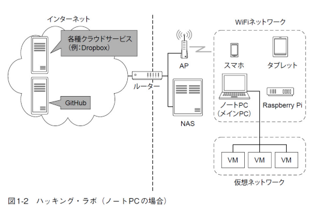
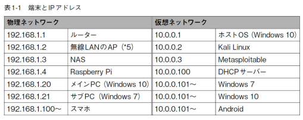
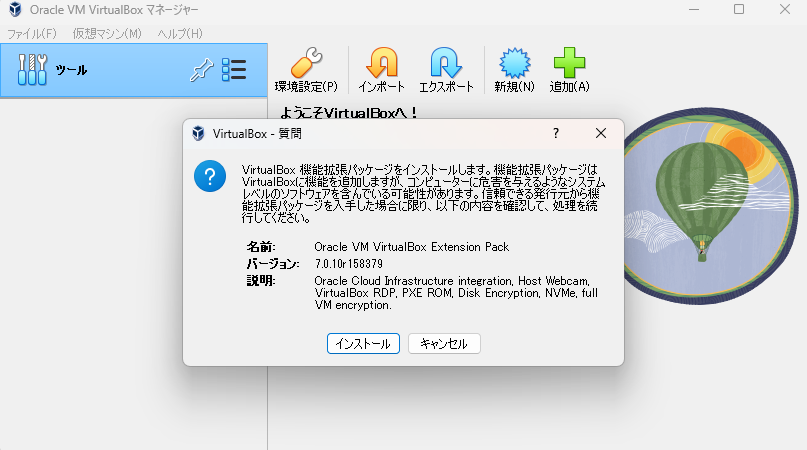
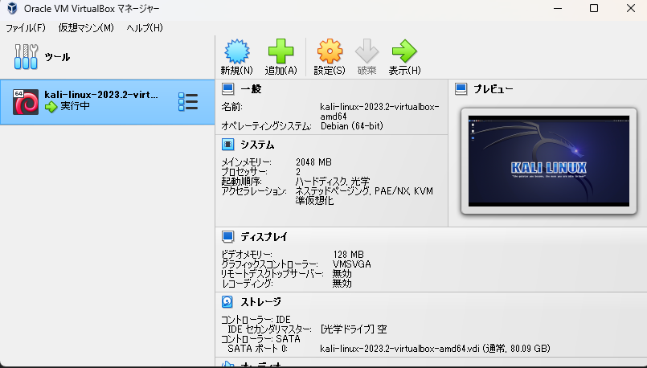
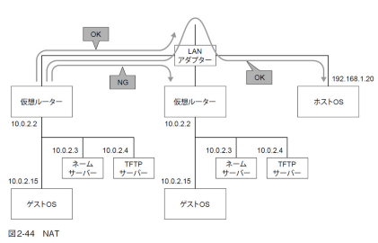
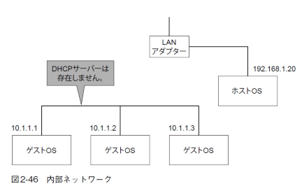

開始日 2023/08/16  
読了日 2023/ * / *  
著者 IPUSIRON 2018年12月7日初版

# 目次
- [目次](#目次)
- [第1部 ハッキング・ラボの構築](#第1部-ハッキングラボの構築)
  - [第1章 ハッキング・ラボでできること](#第1章-ハッキングラボでできること)
    - [1-1 ハッキング・ラボとは](#1-1-ハッキングラボとは)
    - [1-2 本書を読むにあたって](#1-2-本書を読むにあたって)
    - [1-3 ハッキング・ラボの移り変わり](#1-3-ハッキングラボの移り変わり)
    - [1-4 なぜハッキング・ラボを作るのか?](#1-4-なぜハッキングラボを作るのか)
    - [1-5 本書が目指すハッキング・ラボの構成例](#1-5-本書が目指すハッキングラボの構成例)
  - [第2章 仮想環境によるハッキング・ラボの構築](#第2章-仮想環境によるハッキングラボの構築)
    - [2-1 仮想環境とは](#2-1-仮想環境とは)
      - [ホスト型](#ホスト型)
    - [ハイパーバイザー型](#ハイパーバイザー型)
      - [コンテナエンジン型](#コンテナエンジン型)
    - [2-2 VirtualBoxのインストール](#2-2-virtualboxのインストール)
    - [2-3 VirtualBoxの基本設定](#2-3-virtualboxの基本設定)
      - [デフォルトの仮想マシンフォルダーを変更する](#デフォルトの仮想マシンフォルダーを変更する)
    - [VirtualBox Extension Packを導入する](#virtualbox-extension-packを導入する)
    - [2-4 VirtualBoxにKali Linuxを導入する](#2-4-virtualboxにkali-linuxを導入する)
      - [Linuxとは](#linuxとは)
      - [Linuxディストリビューションとは](#linuxディストリビューションとは)
      - [Kali Linuxとは](#kali-linuxとは)
      - [Kaliのインストール手順](#kaliのインストール手順)
    - [2-5 初めのKali Linux](#2-5-初めのkali-linux)
    - [2-6 Kali Linuxのカスタマイズ](#2-6-kali-linuxのカスタマイズ)


# 第1部 ハッキング・ラボの構築
## 第1章 ハッキング・ラボでできること
### 1-1 ハッキング・ラボとは
本書に置けるハッキングとはコンピュータに対する攻撃の総称として使用している。(サーバー侵入、遠隔操作、ネットワーク盗聴、パスワード解析など)<br>
**ハッキング・ラボ**とはハッキングの実験を行える環境を指しており、これは物理的な環境にとらわれない様々な環境のことを指している。<br>
例えば、部屋に複数台のPCを設置してネットワークに繋げている、1台のノートPC上に複数の仮想マシンが起動されており、仮想のネットワークで繋がっている、外出先から自宅のLANに接続しているなど全ての環境がハッキング・ラボである。<br>
特に1台のPCのみでもハッキングの実験が十分に可能であるので、本書ではこの環境について主に説明している

### 1-2 本書を読むにあたって
本書で実現できることは以下の要素である
- セキュリティの基礎を理解できる
- 移動可能なハッキング・ラボを構築できる
- すぐに役立つWindowsの基本テクニックが身につく
- プログラムを一元管理できる
- C言語やPythonなどのプログラミング環境を構築できる
- OS(Windowsとkail Linux)やネットワークの知識が身につく
- 仮想環境により、安全にハッキングを実習
- Windows、Android、Linuxへの攻撃手法を習得できる
- 無線LANに対する攻撃手法(パスワード解析、ネットワーク盗聴)を習得できる
- Webアプリに対する、基本的な攻撃手法を習得できる

想定する読者層は以下の通り
- セキュリティの諸学者
- ハッカーに憧れている人
- CTFに興味がある人、または参加している人
- WindowsとLinuxの混在環境を構築したい人
- コンピュータ愛好家
- Linux初心者

前提知識は以下の通り
- Windowsの基本操作(ファイルの圧縮・解凍、アプリのインストールなど)
- Linuxの基本的なコマンドを操作できる
- 自宅に小規模なLANを構築できる

### 1-3 ハッキング・ラボの移り変わり
 PCやインターネットの環境の変化はハッキングにも大きな影響があり、状況も進化してきている。<br>
 この章では簡単にPCの歴史を振り返りながら、どのようにハッキング・ラボが進化したかについて説明する

- インターネットの普及(1995年~)<br>
Windows95の登場で一般家庭にインターネットが普及し始める。当時PCは高額であったため、自宅にハッキングラボを構築する事が困難であったため、多くの人はインターネット上の他人のPCを攻撃することでハッキングのスキルを向上させていた。当時のはセキュリティが甘く、簡単に侵入したり、遠隔操作ができた
- 自作PCの普及(1998年~)<br>
PCを構成する部品を購入した方が、メーカー製のPCを買うより安価であったため、PC好きにとっては自作が当たり前になる。その結果、余ったパーツで別の1台PCを構築することも可能であるため、その結果自宅に複数のPCを揃えたネットワークを組むことが自然な発想となった。<br>
また、余ったPCにLinuxをインストールするというコンセプトから、雑誌などにも取り上げられ、一般ユーザーにLinuxが普及し始めた。メインPCにWindowsとLinuxの両方をデュアルブートできるようにしたり、HDDケースを付け替えることで起動するOSを変更するなどの方法も一般的になってきた。こうした背景から自宅に複数の物理PCやOSでハッキング・ラボが構築されるようになった
- 常時接続の普及(2000年~)<br>
比較的安価で常時接続サービス(ADSLなど)に加入できるようになり、自宅にサーバーを設置してインターネットに公開することが流行した.またWebサービスも多様化し、ブログの全身とも言えるWebアプリケーションが登場した。<br>
この頃になるとセキュリティが謳われるようになり、2000年には**不正アクセス禁止法**が施行された。
- 無線LAN・仮想環境の普及(2005年~)<br>
無線LANの普及により、物理的なケーブルに束縛されることなく、ネットワークが構築できるようになった。また、安価な小型のノートPCが流行し始めた<br>
物理PCの複数設置は場所の占有やコストの問題があったが、PCのスペックの向上に伴い、**仮想環境**が実現し始める。これにより、1台のPCの中に仮想マシンを作成できるようになり、ハッキング・ラボの物理的なスリム化が進む。
- スマートフォンの普及(2010年~)<br>
ソフトバンクやドコモがiPhoneやAndroidなどを発売しはじめ、スマフォが爆発的に普及する。これによりPCユーザー以外もネットワークに接続するようになり、SNSを使用するユーザーが急増した。<br>
スマホを利用することで出先からインターネットにアクセスできるようになった。これはハッキング・ラボの観点から言えば、出先から自宅のLANに存在するハッキング・ラボに接続できるということである。これにより、ハッキング・ラボには物理的な制限がほとんどなくなった。
- クラウドストレージの普及(2014年~)<br>
クラウドストレージはインターネット上にファイルを保存できるサービス(Dropboxなど)である.<br>
従来でもレンタルサーバやWebスペースを借りれば、そこにファイルを保存することが可能ではあったが、アップロードする作業が必要であった。それに対して、クラウドストレージはクラウドストレージと任意の端末の間でデータを簡単かつ自動的に同期できるため、ほとんど意識せずにバックアップを実現できるようになった。<br>
ただし、動画などの重たいファイルの保存場所としては容量が少ないため、そういう場合は自宅のネットワークにファイルサーバーやNASを設置して対応する。現在販売されているNASはネットワーク機器に特別な設定をすることなく、インターネット側からアクセスできる仕組みを備えている<br>
ハッキング・ラボの観点から言えば、ノートPCを持たずに外出しても、いつも持ち歩くスマホを使ってクラウドストレージやNASにアクセスすることでハッキング用のプログラムを即座に入手することができる

### 1-4 なぜハッキング・ラボを作るのか?
ハッキング・ラボはセキュリティの専門家にとって極めて重要であるが、本書では初学者にこそハッキング・ラボを構築してもらいたいと考えている。<br>
初学者がハッキング・ラボの構築を通して次の2つの目標を実現することができる
1. 「いつでも」「どこでも」利用できるハッキング・ラボを構築する<br>
   - 本書では主に仮想環境を駆使したハッキング・ラボを構築することを目指す。
   - その構築作業を通じて、OSやネットワークの知識を吸収することができる。またネットワークに接続するというだけではなく、制限するという観点から考える事ができるようになる<br>
   - ハッキング・ラボがある程度完成すれば、ハッキングの実験のハードルが下がり、「いつでも」ハッキングができるようになる<br>
   - 外出先などでも「どこでも」ハッキングができるようになる。特に勉強会やCTFに参加するたびに、持参するノートPCの環境構築に時間を費やす事もなくなる
2. ハッキング・ラボを活用して、ハッキングのスキルを身に着ける
   - 仮想環境の中で攻撃端末とターゲット端末を構築して、攻撃と防御を自分で体験してみることで、セキュリティの理解を深める事ができる
   - ハッキングの指南をする書籍は多く存在するが、環境の構築に言及する本は少ない。ハッキングに興味をもった若者がそのハッキングを試した結果、逮捕されてしまう事は非常に勿体ないので、健全なハッキングの実験を試せる環境を構築できるようにする。


### 1-5 本書が目指すハッキング・ラボの構成例
本書では次のような環境を仮定して解説を行う
- 自宅にLANを構築している
- 無線のLANのAPが存在しており、各端末が接続できる
- メインPCは仮想環境を利用できるスペックを備えている



デスクトップPCでもノートPCでも良いが、ノートPCは外出先に持ち出せるため、出先でハッキング・ラボを活用する場面で状況が違ってくる場合などはある。
ここではメインPCにWIndows10、仮想化ソフトにVirtual Boxを用いる事を想定している。
NASはあると便利だが、必須ではない。Rasberry Piは手のひらサイズのコンピュータで5000円程度で購入できるので、実験用のサーバーを構築するのに良い。仮想環境で実現しにくい場合は実機を用いて対応することもある。<br>
メインPCがデスクトップPCの場合に外出先でハッキングの実験をしたい場合に他のPCに環境を構築するのは手間がかかる上、二重管理になってしまうので、何らかの方法で自宅のネットワーク、あるいは端末に接続する事が望ましい。本書ではVPNとChromeリモートデスクトップを紹介する。VPNを使えば出先からでも自宅のLANに接続でき、LAN内の端末にアクセスできるようになる。さらにChromeリモートデスクトップを使えば、出先のChromeブラウザからLAN内のメインPCであるWindows10を遠隔操作できるようになるので、chromeブラウザがあればスマホやタブレットからも操作できるようになる。<br>
以上より、出先でもハッキング・ラボを活用、すなわちいつでもどこでもハッキングの実験を実現できる。

**本書におけるネットワーク構成の例**<br>
本書には様々な端末が登場するが、ネットワーク構成は以下の表のように設定している。IPアドレスに関しては自分の環境に合わせて設定するようにする必要がある


## 第2章 仮想環境によるハッキング・ラボの構築
### 2-1 仮想環境とは
**仮想化**とは実際に限られた数しかないものをあたかもそれ以上の数があるかのように見せる技術のことを指す。この概念は古くからあり、仮想メモリはHDDをメモリのように扱う事で、物理メモリの容量が足りなくなっても仮想メモリが補う仕組みになっています。1つのハードウェアで複数のサービスを提供することや、ハードウェアでは提供できないサービスをソフトウェアによって提供する事も仮想化の一つです。<br>
近年ではハードウェアの発達により、1台のPC内で仮想的に複数のサーバーを立ち上げることもできるようなった。つまり、1つのOS内で複数のOSが動くようになったというわけで、これをサーバー仮想化という。

**仮想化ソフトと仮想マシン**<br>
仮想環境はソフトウェアで実現された仮想的なコンピュータです。そのため、1つの物理PC上で複数のOSを起動できます、複数のOSをやり取りする仮想のネットワークも必要になりますが、これも仮想環境の一部と言えます。<br>
本書では仮想環境を実現するソフトを**仮想化ソフト**、仮想ソフトによる仮想的なPC環境を**仮想マシン**と呼びます。

仮想マシンを使うメリットとしては以下の理由があります。
- 物理的なストレージ(HDD,SSD)上に置かれるため、容易にコピーや複製が可能
- 物理的なスペースが必要なく、電気代も物理的サーバーを立てるよりも安い

仮想化ソフトは次の3種類に分類されます。
- ホスト型
- ハイパーバイザー型
- コンテナエンジン型


#### ホスト型
ベースとなるOS上に仮想化ソフトをインストールし、その仮想化ソフト上に仮想化マシンを構築する。
- 利点<br>
仮想マシンは特定のハードウェアに依存しないため、任意のOSをインストール可能という利点があり、手軽に構築できる。
- デメリット<br>
ホストOSに負荷がかかると仮想マシンのパフォーマンスが低下しやすく、ホストOSのセキュリティ問題から仮想環境が影響を受けることもある<br>

ホスト型は仮想マシンの作成が手軽であるため、実験用途向けといえ、本書ではこのホスト型である**VirtualBox**でハッキング・ラボを構築する。

例
- VirtualBox(https://www.virtualbox.org/)
- Workstation Player\Pro(https://www.vmware.com/jp/products.html)

### ハイパーバイザー型
動作にOSを必要とせず、ハードウェア上で直接動作して、複数の仮想マシンを動かすための土台となるソフトウェア。物理サーバーのCPUに組み込まれている仮想化技術を利用している。
- 利点<br>
物理マシンのハードウェアに直接アクセスができるため、実機上のOSを動かした時と遜色のないパフォーマンスが得られる
- デメリット
ハイパーバイザーはハードウェアを直接制御する関係上、専用のドライバーが必要で扱える周辺機器が少ない

ハイパーバイザー型は性能を最大限ひきだせるため、仮想マシンを継続的に動作させることができるため、本番環境の運用に向いている<br>

例
- Hyper-V(https://learn.microsoft.com/ja-jp/virtualization/hyper-v-on-windows/)
- vSphere Hypervisor(https://www.vmware.com/content/vmware/vmware-published-sites/jp/products/vsphere-hypervisor.html.html)
- KVM(http://www.linux-kvm.org/page/Main_Page)

#### コンテナエンジン型
コンテナ型はユーザーから隔離されたアプリの実行環境を作り、あたかも独立したサーバーのように実行する事ができる。<br>
今までホストOSやハイパーバイザーの上にゲストOSを起動し、そのOS上でアプリを動かすという仕組みを取っていたのに対して、コンテナ型ではゲストOSを起動せず、ゲストOS対応のアプリを軌道する。コンテナエンジンを起動し、ホストOSに対応するライブラリを読み込むことでアプリの起動を実現する。
- 利点<br>
ゲストOSの起動や設定が不要であるため、アプリの軌道が早く、処理が軽量
- デメリット<br>
コンテナはベースとなるOSと同じカーネルを使用しなければならない。(この制限を解決するために仮想化ソフトの技術が併用されるようになった)

コンテナ型は軽量・高速であるという特徴から開発によく用いられる

例
- Docker(https://www.docker.com/)
- kubernetes(https://kubernetes.io/)

ホスト型の場合、ホストコンピュータは仮想マシンを立ち上げる側のコンピュータで、それに対してゲストコンピュータは仮想マシンのことを指します。これをホストOS,ゲストOSとそれぞれ呼ぶ。例えば、WindowsにVirtualBoxを導入して、Linuxを立ち上げた場合、ホストOSがWindowsでゲストOSがLinuxとなる

### 2-2 VirtualBoxのインストール
VirtualBoxを用いた仮想環境の構築手順について説明する

1. VirtualBoxのインストーラーをダウンロード<br>
Oracle(https://www.oracle.com/jp/virtualization/technologies/vm/downloads/virtualbox-downloads.html)のサイトからVirtualBoxのインストーラをダウンロード
2. インストーラを実行<br>
そのまま流れでおｋ
3. VirtualBoxを起動する

正しく起動ができていれば以下のような画面が表示される


### 2-3 VirtualBoxの基本設定
VirtualBoxのメイン画面のメニューから「環境設定」を選択して、基本的な設定を適用する

#### デフォルトの仮想マシンフォルダーを変更する
ハッキング・ラボを拡張するにしたがい、仮想マシンに導入するゲストOSは次々に増えていくので、予めゲストOSを配置する場所を決めておくことをオススメする。<br>
ゲストOSを置く場所は数十GB以上の領域を確保しておくと良い。

### VirtualBox Extension Packを導入する
**VirtualBox Extension Pack**はVirtualBoxに機能を追加するためのプログラムである。
例えば次の機能などが追加できる。
- USB2.0/3.0のサポート
- VirtualBoxのリモートデスクトップ機能
- ディスクの暗号化
- Webカメラのサポート

特にUSB2.0以上のサポートにより、転送速度の向上が期待できる外付けHDDや無線LANアダプタの性能を引き出せる

Extension Packの導入手順は以下の通りである
1. Extension Packをダウンロードする<br>
VirtualBox()のサイトからExtension Packをダウンロードする
2. ダウンロードをすると以下の表示が出るのでインストールを押してインストールする



3. インストールされたことを確認する
環境設定画面の「機能拡張」からインストールしたパッケージを確認できる
※自分が確認したところ、ファイル⇒ツール⇒Extension Pack Managerからしか確認できなかった

### 2-4 VirtualBoxにKali Linuxを導入する
VirualBoxを用いて、初めて仮想マシンを構築する。まずは**Kali Linux**というOSの仮想マシンを作成することを目的に手順を説明する

#### Linuxとは
Linus Torvalds氏によって開発されたサーバー向けのOSで、フリーかつオープンソースで誰でも自由に改変・再配布ができる。安定して動作するため、元々サーバー用途だったが、現在はデスクトップ向けやスマホ向けにも使われている<br>
ハッキングツールの8割はLinux環境向けに開発されていると言われているので、Linuxを自由に使えるとほとんどのハッキングツールを使用できるようになる<br>
また、他にも以下の利点がある
- 他のOS程高いスペックを要求されない
- Linuxの仕組みを深く知るほど、自分好みにカスタマイズ可能

#### Linuxディストリビューションとは
Linuxは一般的にLinuxディストリビューションという形で配布されている。ディストリビューションは「Linuxカーネル+アプリ」のようなもので、LinuxカーネルがOSのコアとなる、ハードウェアの管理、ファイルシステム、プロセス管理、メモリ管理などといったOSの基本機能をつかさどり、ディストリビューションによってデフォルトインストールのコマンドやライブラリ、アプリケーションが異なる

#### Kali Linuxとは
ペネトレーションテスト用のLinuxディストリビューションである。ペネトレーションテストは実際の攻撃手法を試みて、システムに脆弱性がないかをテストする手法のことで、Kaliには300以上のペネトレーションテスト用のプログラムが最初からインストールされている。

#### Kaliのインストール手順
※この部分は本の情報が古かったので独自のインストール

1. Kaliの仮想イメージをダウンロード(https://www.kali.org/get-kali/#kali-platforms)
Virtual Machine⇒Virtual Boxを選択してダウンロードする
2. ダウンロードした仮想イメージをVirtualBoxの画面にドラッグ＆ドロップ
3. インポートが完了していたら以下のような画面になる<br>

4. 仮想イメージを起動して、以下のパスワードを入力
  - username:kali
  - password:kali

上手くできたらkaliが起動する

### 2-5 初めのKali Linux
バージョンが古く、現在の画面の説明と一致しないので省略<br>
情報的にもそこまで重要ではないし、Linuxの基本画面が理解できていればよい

### 2-6 Kali Linuxのカスタマイズ
Kaliを使いやすいようにカスタマイズする方法を説明
こちらも割と情報が古いのである程度割愛。都度自分で調べる

- 解像度を変更する<br>
  1. 左上のアプリケーションから```setting```⇒```settingManager```⇒```Display```を開く。
  2. 自分のモニタにあった解像度に設定する
- スクリーンロックを無効<br>
そのままだと5分間何も操作しないと画面がロックされる使用になっているため、これは結構めんどくさいのでこれを無効にする<br>
  1. 左上のpower設定からDisplayに関する項目を```Never```に変更する

- VirtualBoxのネットワーク設定
  - 未割り当て
    - ネットワークアダプタを有効にはするが通信できない
  - NAT
    - ホストOSのIPアドレスを共有して外部の物理ネットワークと接続
    - ホストOSとゲストOS間の通信は可能
    - 外部からゲストOSにアクセスしたり、ゲストOS間の通信はできない<br>

  - NATネットワーク
    - ホストOSのIPアドレスを共有して外部の物理ネットワークと接続
    - NATとの違いはNATネットワーク内にDHCPサーバが存在しており、ゲストOSは動的IPを割り当てることが可能
    - ゲストOS間での通信が可能<br>

  - 内部ネットワーク
    - 物理ネットワークとは独立した、ゲストOS間のみのネットワークを構成するモード
    - ホストOSとゲストOS間での通信は不可
    - 各ゲストOSに静的にIPアドレスを割り当てるか、ゲストOSの1つにDHCPサーバーを立ち上げる必要がある<br>

  - ホストオンリーアダプター
    - 外部ネットワークとの通信はできないが、ホストOSとゲストOS間でネットワークを構成する
    - VirtualBoxのDHCP機能でホストオンリーアダプターの設定で指定したIPアドレスが使用される<br>

  - ブリッジアダプター
    - ゲストOSが外部の物理ネットワークに直接接続するモード
    - 物理ネットワークにおけるスイッチハブにゲストOSが接続されているイメージ<br>


本書に置けるKaliのネットワーク構成は以下の条件を満たす必要がある
- ハッキング実験用の内部ネットワークにアクセス可能
  - ゲストOS間のアクセスが必要
- LAN内の端末にアクセス可能
  - 脆弱性調査を行う事で、弱点がないかを調べられる
- ホストOSからKaliにアクセスできる
  - ホストOSとゲストOS間の通信が可能
- インターネットに接続できる
  - 調べものや外部のサーバーの調査、ソフトのダウンロードやアップデートに使用する


Kaliには2つの仮想のLANアダプターを有効にして、それぞれ以下のように割り当てる
- アダプター1
  - ホストオンリーアダプター
  - 静的IPアドレス(Kali側で設定)
    - 10.0.0.2
  - ハッキングの実験用
- アダプター2
  - NAT
  - 動的IPアドレス
  - インターネットやLAN内のとの接続用

Kali側の静的IPアドレスの設定の一般的な設定方法を説明する。Kaliに対する実際の設定はその後で解説する

1. 設定ファイルを編集<br>
```/etc/network/interfaces```ファイルに対して次のように設定。シンプルにLANアダプターは1つしかないものとする<br>

動的IPアドレスの設定
```
# The loopback network inteface
auto lo
iface lo inet loopback

# The primary network inteface
auto eth0
iface eth0 inet dhcp
```

静的IPアドレスの設定
```
# The loopback network inteface
auto lo
iface lo inet loopback

# The primary network inteface
auto eth0
iface eth0 inet static
address 192.168.1.5
netmask 255.2555.255.0
gateway 192.168.1.1
```
```# The primary network inteface```以降に注目すると、```auto eth0```はシステム起動時にインターフェイスeth0を起動する指示で、次のifaceで動的の場合は```dhcp```、静的の場合は```static```を指定する。静的の場合、その後に具体的なIPアドレス設定を記述する形になる。<br>

2. 設定を反映させる<br>
設定ファイルを編集したら、auto指定の場合以下のコマンドで反映できる
``` /etc/network/interfaces restart```

それでは次にKaliで二つのLANアダプタについての設定を行っていく
1. ホストオンリーネットワークを設定
2. 