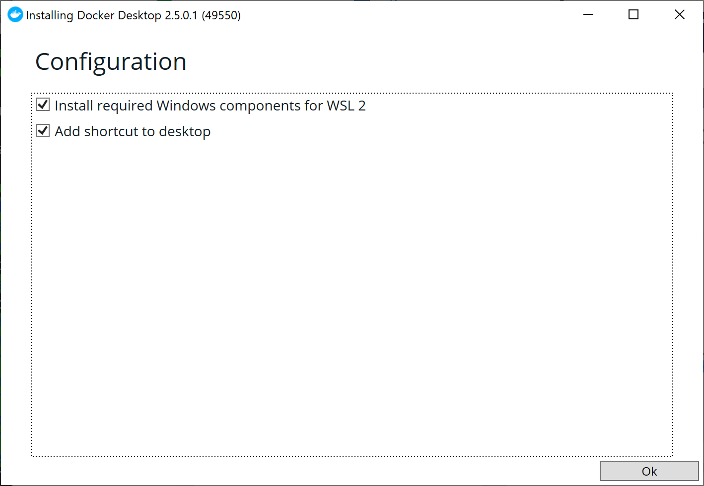

# Docker
コンテナ型の仮想プラットフォーム  
- 簡単に仮想環境を作成可能
  - Dockerfileを予め作成しておくことで、他の人に同じテスト環境を簡単に共有することができる
  - 公式からイメージを引っ張ってくるだけでサーバー等のテスト環境も簡単に作成できる
- ホストOSの上にゲストOSを動かす形ではなく、ホストOSの上に動作しているDocker engineからコンテナと呼ばれるミドルウェアの環境構築がされた実行環境を作成して、その中でアプリケーションを動作させるので軽量


# 環境構築
Widonws+WSL2を使用した環境構築を想定  
WSL2の導入については省略

1. Windows用のDockerデスクトップをインストール  
[公式HP](https://docs.docker.com/desktop/install/windows-install/)からダウンロードしてインストール  

この際に表示される`Use WSL 2 instead of Hyper-V`についてはチェックを入れる


2. 特にエラーが出ていなければインストール完了  
以下のコマンドを実行して特にエラーが起きていなければ正常にインストールできている
```
docker run hello-world
```

# 基本的なコマンド
## run
Dockerコンテナの作成・起動のためのコマンド
```
docker run [option] Docker_Image名  
```
- `-v local_pass:mnt_pass`でローカルのディレクトをマウントすることが可能
- `-it`は`--interactive --tty`を意味する
  - `-t`オプションは疑似端末の意味でシェルを開く
  - `-i`オプションによってキー入力を受け付ける
- `--rm`オプションで終了後にコンテナを削除可能


## ps
Dockerコンテナの一覧を表示するためのコマンド
```
docker ps [-a]
```
- `-a`コマンドで停止しているコンテナを含めて表示可能

## start
作成済みのDockerコンテナに対して、起動するためのコマンド
```
docker start コンテナ名
```

## attach
起動中のコンテナに接続
```
docker container attach コンテナ名
```

## stop,kill
起動中のDockerコンテナに対して、停止するためのコマンド
```
docker stop/kill コンテナ名
```

## rm
作成済みのコンテナを削除
```
docker rm コンテナ名
```

## cp
コンテナとローカル感でファイルやフォルダのコピーを行う
```
docker cp コピー元　コピー先
```

## pull
公式のDockerImageを持ってくる
```
docker pull イメージ名
```

## imgaes
Dockerイメージについてのコマンド。ダウンロード済みのイメージの一覧を表示したり、pullしたりできる
```
docker pull イメージ名
```

## build
Dockerfileからイメージを作成。Dockerfileについては[こちら]()を参照
```
docker build コンテナ名
```

## container 
コンテナ管理用のコマンド.指定したコンテナに対してコマンドを実行できる
```
docker container COMMAND
```
