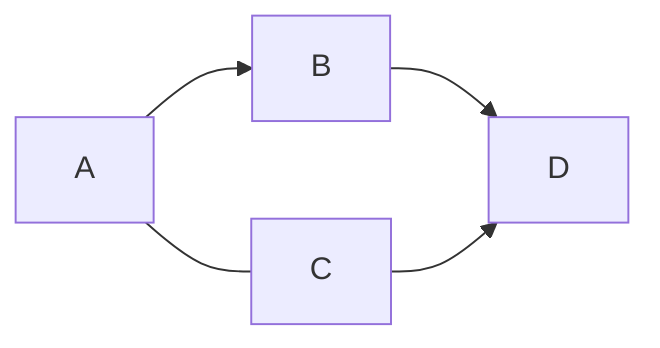

<!-- omit in toc -->
# Markdown記法
見出しの装飾や強調等の文字修飾を簡単にできる記法  
会議の議事録やメモ作成を効率化できるので覚えておくと便利  

<!-- omit in toc -->
# 構文チートシート
- [共通記法](#共通記法)
  - [見出し(#)](#見出し)
- [見出し1](#見出し1)
  - [見出し2](#見出し2)
    - [見出し3](#見出し3)
  - [箇条書き(-)](#箇条書き-)
  - [番号付きリスト(1.)](#番号付きリスト1)
  - [引用(\>)](#引用)
  - [コード(\`\`\`)](#コード)
  - [チェックボックス(\[\])](#チェックボックス)
  - [改行](#改行)
  - [強調](#強調)
  - [水平線](#水平線)
  - [表・テーブル](#表テーブル)
  - [リンク](#リンク)
  - [画像](#画像)
  - [数式の挿入](#数式の挿入)
- [Mermaidによるクラス図作成](#mermaidによるクラス図作成)
  - [グラフ](#グラフ)
- [Github Flavored Markdown(GFM)限定](#github-flavored-markdowngfm限定)
  - [取り消し線(~~)](#取り消し線)

[Top]: #構文チートシート

# 共通記法
## 見出し(#) 

```
# 見出し1
## 見出し2
### 見出し3
```

# 見出し1
## 見出し2
### 見出し3

<br>

[TOPに戻る][Top]  
## 箇条書き(-)
```
- A
  - a
  - b
- B
```
- A
  - a
  - b
- B

<br>

[TOPに戻る][Top]
## 番号付きリスト(1.)
```
1. A
   1. a
   2. b
2. B
```
1. A
   1. a
   2. b
2. B  

<br>

[TOPに戻る][Top]  
## 引用(>)

```
> 文章
> テスト
>> 二重引用も  
>> 可能
```
> 文章  
> テスト
>> 二重引用も  
>> 可能

<br>

[TOPに戻る][Top]  
## コード(```)
```
`コード`　//行中の関数名等

$```
 コード   //コード全体の張り付け($はいらない)
$```

$```言語
 コード   //言語を指定することも可能
$```

```

この`コード`に注目
```
コード
```

```C++
#include <stdio.h>

int main(){
    printf("hello world");
    return 0;
}
```

<br>

[TOPに戻る][Top]  
## チェックボックス([])

```
- [x] チェック1 //x
- [ ] チェック2 //半角スペース
```
- [x] チェック1
- [ ] チェック2

<br>

[TOPに戻る][Top]  

## 改行
半角スペース二つか`<br>`で改行可能
```
この文章は<br>改行された.  
```
この文章は<br>改行された.  

[TOPに戻る][Top]  

## 強調
```
#斜体(*,_)
通常 *斜体* 
通常 _斜体_

#太字(**,__)
通常 **太字** 
通常 __太字__

#複合(***,___)
通常 ***複合*** 
通常 ___複合___
```
通常 *強調*  
通常 _強調_  
通常 **太字**  
通常 __太字__  
通常 ***複合***  
通常 ___複合___

<br>

[TOPに戻る][Top]  
## 水平線
```
# *,-,_を3つ以上連続(間にスペースがあっても良い)
* * *
- - -
_ _ _
```
1行目
***
2行目
- - - 
3行目
_ _ _

<br>

[TOPに戻る][Top]  

## 表・テーブル
揃っていないと正常に表示されないので注意
```
|  TH  |  TH  |
| ---- | ---- |
|  TD  |  TD  |
|  TD  |  TD  |
```
|  TH  |  TH  |
| ---- | ---- |
|  TD  |  TD  |
|  TD  |  TD  |
<br>

[TOPに戻る][Top]  
## リンク
```
[タイトル](URL)

//定義参照リンク
[タイトル][参照]
[参照]:URL
```
[このページ](https://github.com/humiki-kirora/enginner_study/blob/main/Language/Markdown/Markdown%E8%A8%98%E6%B3%95.md#%E3%83%AA%E3%83%B3%E3%82%AF)

[参照リンク][url]  

[url]: https://github.com/humiki-kirora/enginner_study/blob/main/Language/Markdown/Markdown%E8%A8%98%E6%B3%95.md#%E3%83%AA%E3%83%B3%E3%82%AF

<br>

[TOPに戻る][Top]  
## 画像
```

or

```


<br>

[TOPに戻る][Top] 

## 数式の挿入
詳しくはKaTeX記法を参照
```
$KaTex記法$
```
$y =\begin{cases} 0 &text{if } b \\ 1 &text{if } a \end{cases}$

# Mermaidによるクラス図作成

## グラフ
グラフの向きはTB、TD、BT、RL、LRなどでどの方向からどの向きに書くかをコントロール可能<br>
⇔を-に変えることで無向グラフも可能
```
$```mermaid
graph RL;
  A-->B;
  A---C;
  B-->D;
  C-->D;
$```
```




# Github Flavored Markdown(GFM)限定
GitHubの独自仕様を加えたMarkdown記法(普通に使えるのもあるっぽい)

## 取り消し線(~~)
```
~~取り消し~~
```
~~取り消し~~
