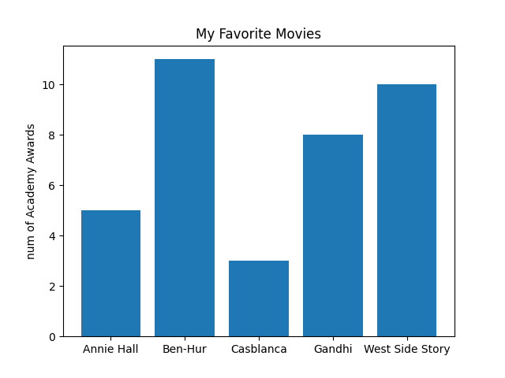
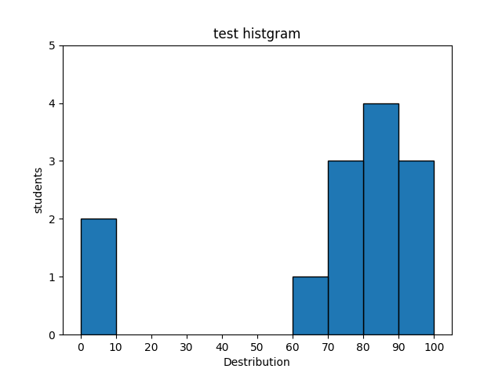
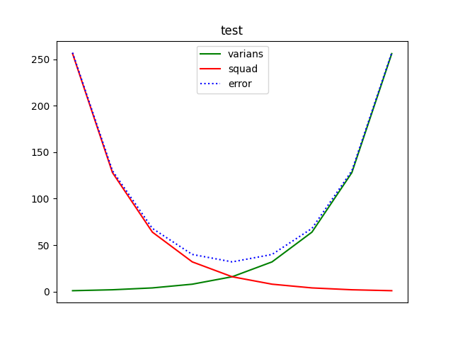
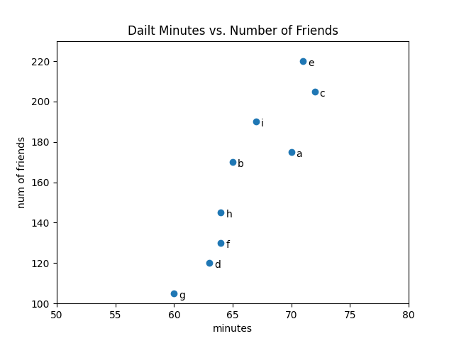

<!-- omit in toc -->
# 目次
- [matplotlib](#matplotlib)
- [棒グラフ](#棒グラフ)
- [折れ線グラフ](#折れ線グラフ)
- [散布図](#散布図)
- [あとがき](#あとがき)

[Top]: #目次

# matplotlib
pythonにおけるデータの可視化モジュール
簡単な棒グラフや折れ線グラフ、散布図などを作成するのに役立つのでよく使われる
基本的には**matplotlib.pyplot**モジュールについて取り上げる

# 棒グラフ
離散的な項目をもつ量の違いを可視化するのに良い
例) アカデミー賞の受賞数
```python
import matplotlib.pyplot as plt

movies = ["Annie Hall", "Ben-Hur","Casblanca","Gandhi","West Side Story"]
num_oscars = [5,11,3,8,10]

# x座標[0,1,2,3,4]に高さnum_oscar分の棒グラフをプロット
plt.bar(range(len(movies)),num_oscars)

# キャプション
plt.title("My Favorite Movies")
plt.ylabel("num of Academy Awards")

# 棒の中心に合わせて映画の名前を付ける
plt.xticks(range(len(movies)),movies)v

plt.show()
```

結果はこんな感じ



棒グラフはデータの集まりの分布を表現する**ヒストグラム**に適している
```python
from collections import Counter
import matplotlib.pyplot as plt
grads = [83,95,91,87,70,0,85,82,100,67,73,77,9]

# Counterクラスで0~9,10~19...の数を計算
hist = Counter(min(g // 10 * 10, 90) for g in grads)

plt.bar([x + 5 for x in hist.keys()], #グラフの位置を右にずらす
        hist.values(), # 値に合わせた高さにする
        10, # 棒の幅を10にする
        edgecolor=(0,0,0))

plt.axis([-5,105,0,5])#x軸の範囲を-5~105、y軸を0~5に設定
plt.title("test histgram")
plt.ylabel("students")
plt.xticks([x for x in range(0,101,10)])
plt.xlabel("Destribution")
plt.show()
```



正しくデータを見せるには、特に**plt.axis()** の使い方には注意が必要
例えば、データ数の差がごく僅かでも軸の範囲を狭くしてしまえば、その差が大きな差であるかのように見せてしまう事もできる。
使う側としても見る側としても軸の見せ方については注意していきたい

[Topに戻る][Top]

# 折れ線グラフ
値の時系列的な動きを見るのには**折れ線グラフ**が適している
```python
from collections import Counter
import matplotlib.pyplot as plt

v = [1,2,4,8,16,32,64,128,256]
bias_sq = [256, 128, 64, 32, 16, 8, 4, 2, 1]
total_error = [x + y for x,y in zip(v,bias_sq)]
xs = [i for i,_ in enumerate(v)]

#plot()を複数呼び出して、折れ線を描画
#"g-"は緑の実線　文字で色を指定して、-で線のタイプを指定
plt.plot(xs,v,"g-",label="varians")
plt.plot(xs,bias_sq,"r-",label="squad")
plt.plot(xs,total_error,"b:",label="error")

plt.legend(loc=9) #凡例の表示 loc=9は上部中央に表示
plt.title("test")
plt.xticks([])
plt.savefig("polyline.png")
plt.show()
```


[Topに戻る][Top]

# 散布図
二つのデータの関係を可視化する時には**散布図**が有効
```python
from collections import Counter
import matplotlib.pyplot as plt

friends = [70, 65, 72, 63, 71, 64, 60, 64, 67]
minutes = [175,170, 205, 120, 220, 130, 105, 145, 190]
labels = [chr(x + ord("a")) for x in range(0,len(friends))]

# 散布図はscatter
plt.scatter(friends,minutes)

for label,friend,minute in zip(labels,friends,minutes):
    plt.annotate(label,
                 xy=(friend,minute), #各点にラベルをつける
                 xytext=(5,-5), #右下にずらす
                 textcoords="offset points")

plt.title("Dailt Minutes vs. Number of Friends")
plt.axis([50,80,100,230])
plt.xlabel("minutes")
plt.ylabel("num of friends")
plt.savefig("scatter.png")
plt.show()
```



[Topに戻る][Top]

# あとがき
ひとまずよく使うグラフだけまとめたがこれ以外にも3D描画などの機能も存在している
より高度な可視化方法について知りたければ以下のサイトが参考になる

- [matplotlibギャラリー](https://matplotlib.org/stable/gallery/)
- [seaborn](https://seaborn.pydata.org/)
  - matplotlibの上に構築された、より高度な可視化を行う事ができるライブラリ
- [Altair](https://altair-viz.github.io/index.html)
  - 宣言的な可視化を作成するライブラリ
- [D3.js](https://d3js.org/)
  - pythonライブラリではないが、Web上で洗練された対話型の可視化を行うためのJavaScriptライブラリ
- [Bokeh](https://bokeh.org/)
  - D3的な可視化をpythonで行う為のライブラリ

[Topに戻る][Top]
