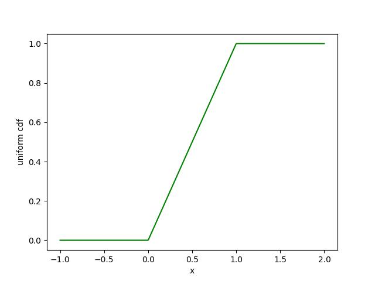
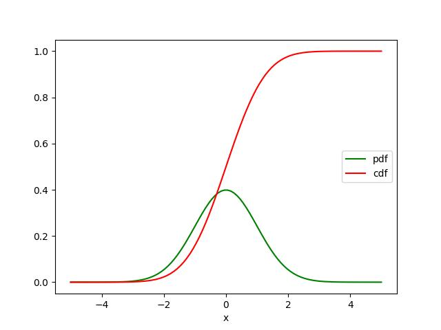

<!-- omit in toc -->
# 確率

<!-- omit in toc -->
# 目次
- [基礎知識](#基礎知識)
  - [従属と独立](#従属と独立)
  - [条件付き確率](#条件付き確率)
  - [ベイズの定理](#ベイズの定理)
  - [確率変数](#確率変数)
  - [連続確率分布](#連続確率分布)
  - [正規分布](#正規分布)
  - [中心極限定理](#中心極限定理)


# 基礎知識
## 従属と独立
ある事象Aが起きた時に別の事象Bが発生する確率がAに関係ない場合を**独立**といい、
逆に事象Aが起きた時に事象Bの発生する確率が分かる場合を**従属関係**という

||例|
|---|---|
|独立|A:1つ目のコインを投げて表が出る確率 B:2つ目のコインを投げて表が出る確率|
|従属|A:1つ目のコインを投げて表が出る確率 B:Aが発生したことを確認した上で、両方のコインが表になる確率|

この例の場合、従属の場合はAの事象の結果でBの確率が変わるので従属関係である

また独立の場合、各事象のが起きる確率を $P(A),P(B)$ とすると、その両方が起きる確率は以下の関係性になる
 $P(A,B) = P(A)P(B)$ 

この時の $P(A,B)$ を**同時確率**という

## 条件付き確率
二つの事象が独立の場合は先ほどの式で表せれるが、従属関係にある場合は以下の式で表される
 $P(A|B) = \frac{P(A,B)}{P(B)}$ 

この時の事象Bが発生した時のAの確率 $P(A|B)$ を**条件付き確率**という

ちなみに二つの事象が独立である場合、条件付き確率は
 $P(A|B)  = P(B)$ 

例）
ある人には二人の子供がいて、以下の条件にしたがって子供が生まれるとする
- 女子と男子が生まれてくる確率は同じ
- 2人目の子供の性別は、1人目の子供の性別と独立である

この場合、両方とも女子の確率 $P(A)$ は $\frac{1}{4}$ で、男女である確率 $P(B)$ は $\frac{1}{2}$ である。
ここで、「1人目の子供が女の子である」という事象 $P(G)=\frac{1}{2}$ がある時、この条件のもと両方とも女の子である確率は
 $P(A|G) = P(A,G)/P(G) = \frac{\frac{1}{4}}{\frac{1}{2}} = \frac{1}{2}$ 

これは直感的にも正しいと理解できる

同様に、「少なくともどちらかが女の子である」事象 $ P(L) = \frac{3}{4}$ のもと、両方とも女の子である確率は
 $P(A|L) = P(A,L)/P(L) = \frac{\frac{1}{4}}{\frac{3}{4}} = \frac{1}{3}$ 

この条件の場合、男女である確率が $\frac{2}{3}$ であるため、両方が女の子である確率よりも2倍あることになる

## ベイズの定理
事象Aが発生した時にそれとは独立した事象Bが発生する確率を求めたいとする。
ただしこの時、事象Bが発生した時に、事象Aが起こる確率しか既知の場合、以下の手順で確率を求めることができる
 $P(B|A) = \frac{P(B,A)}{P(A)}= \frac{P(A|B)P(B)}{P(A)}$  
※条件つき確率の式より、 $P(B,A) = P(A,B) = P(A|B)P(B)$ 

またこの時、AとBは独立であることを考えると、
 $P(A) = P(A,B) + P(\overline{B},A)$ 
※ $\overline{B}$ は事象Bの否定

また、事象Bにいくつかのパターンがある場合、 $P(A)$ を否定を使わずに以下のように書くことも可能
 $P(A) = P(A,B_1) + P(A,B_2) + ... + P(A,B_i)　= \Sigma_{n=1}^{i}P(A,B_n)$ 


よって,以下の式で表すことができる。
 $P(B|A) = \frac{P(A|B)P(B)}{ P(A,B) + P(\overline{B},A)} = \frac{P(A|B)P(B)}{\Sigma_{n=1}^{i}P(A,B_n) }$  

この式関係を**ベイズの定理**という

ベイズの定理の使用例)
>発症する確率が10000人に1人の疾患があり、この疾患を99%の正確さで検出できる検査方法があるとする

ここで、「疾患を持っている」確率を $P(A)$ とすると $P(A)=0.0001$ である。
この時、「検査結果が陽性」であるという事象を $P(B)$ とすると、
「疾患が陽性と判断された中で、本当に疾患を持っている」確率 $P(A|B)$ は
 $P(A|B) = \frac{P(B|A)P(A)}{P(B)} = \frac{P(B|A)P(A)}{ P(A,B) + P(\overline{B},A)}  = \frac{P(B|A)P(A)}{ P(B|A)P(A) + P(B|\overline{A})P(\overline{A})}$  

この時、「疾患を持っている人が、陽性と判断される」確率 $P(B|A)=0.99$ であり、「疾患を持っていない人が、陽性と判定される」確率 $P(B|\overline{A})=0.01$ であるから、
 $P(A|B) = \frac{0.99 \times 0.0001}{ 0.99 \times 0.0001 + 0.01 \times * 0.9999} = 0.00980392156$ 

つまり、精度が99%の検査だとしても、検査で陽性と判断された人が実際に疾患を患っている確率は1%以下なのである。
※ これは無作為抽出だから起きる現象で、実際にはある種の症状が出ている人のみを対象に検査が行われるので、「症状が出ている人の中」という条件が加わればもっと高くなるはず

これはスケールを大きくすると分かりやすくなる、例えば100万人を対象にとすると、実際に疾患があるのは100人であり、疾患がない人が999900人であるが、疾患がないのに陽性とされる人は9999人いるし、疾患が合って陽性と判断される人は99人である。
よって、陽性と判断された人99 + 9999人の中で本当に陽性なのは99人しかいないのである。

## 確率変数
**確率変数**とは確率分布に関連づいた値を持つ変数のこと
(例: サイコロで出た数字が点数になるなど)

確率変数の値を確率の重み付き平均をとったものを**期待値**と呼び、これは様々な事に利用される
例えば、通常のサイコロの期待値は以下のようになる
 $E = \frac{1}{6} * 1 + \frac{1}{6} * 2 + \frac{1}{6} * 3 + \frac{1}{6} * 4 + \frac{1}{6} * 5 + \frac{1}{6} * 6 = \frac{21}{6} = 3.5$ 
つまり、サイコロを複数回振った時に平均の出目は3.5以上の数字になる事が分かる
マリオパーティーなどで特殊なサイコロがあるが、その期待値をこの計算で求める事ができるので、最善の選択をする際に参考になる

また、条件付き確率の事象においても期待値は定義可能
例えば、[条件付き確率](#条件付き確率)で出した、子供の例に当てはめて女子の人数を確率変数として期待値を計算してみる
条件付けをしないまま、期待値を計算すると以下のようになる
 $E = \frac{1}{4} * 0 + \frac{1}{2} * 1 + \frac{1}{4} * 2 = 1$ 

ここで「2人の内少なくともどちらかが女子」であるという条件を付けると、以下のようになる
 $E = \frac{2}{3} * 1 + \frac{1}{3} * 2 = 1.3333...$ 

確率変数は多くの場面で特別に言及される事もなく、使われる位には基本のことなので、理解しておく必要がある

## 連続確率分布
コイン投げやサイコロなどの例は**離散確率分布**に相当しており、離散的な結果に対する正の確率に関連付けられる。

一方で連続した結果の分布をモデル化する必要もある。
例えば、**一様分布**は0 - 1の範囲の全ての数の出現頻度が等しい確率分布であるが、0 - 1間には無限の数があることを考えると、全ての数の出現頻度を0にしなければならなくなってしまう。
こうなると、上手く連続な確率を表現出来ないため、連続分布は基本的に**確率密度関数(Probability Density Fuction:PDF)** で表現され、確率変数がある範囲の値を取る確率はその範囲の確率密度を積分することで得られるようにする。
例えば、一様確率分布を仮定して[0.2,0.3)の間の数が出現する確率を求める場合、[0.2,0.3)の範囲で確率密度関数を積分すると $\frac{1}{10}$ になることは想像しやすい

また、確率変数の値がある値以下になる確率を求める時は、積分でも求まるが、**累積分布関数(Cumulative Distiribtion Function:CDF)** を用いる場合が多い。一様分布の累積確率分布関数は以下のようになっている。
```python
import numpy as np
import matplotlib.pyplot as plt

def uniform_cdf(x):
    x = np.clip(x,0,1)
    return x

x = np.linspace(-1.0,2,500)

cdf = uniform_cdf(x)

plt.plot(x,cdf,"g-")
plt.xlabel("x")
plt.ylabel("uniform cdf")
plt.savefig("uniform_cdf.jpg")
plt.show()
```


これを用いれば、ある数以下の数字が出現する確率を知りたいときに、その値を参照することですぐに求める事が可能

逆に特定の確率になるその値を見つけたい場合にはCDFは単調増加関数であるため、**二分探索**などを用いることで効率的に値を探索する事も可能

## 正規分布
**正規分布**はあらゆる分布の中で最も重要な分布関数である。
確率密度関数は以下の式で表される
 $f(x|μ,σ) = \frac{1}{\sqrt{2 \pi \sigma}} \exp(- \frac{(x - \mu)^2}{ 2 \sigma^2})$ 

正規分布は釣り鐘型の形をしており、平均値 $\mu$ が正規分布の中心の位置、標準偏差 $ \sigma$ はすその広がり具合を制御している。

特に $\mu=0,\sigma=1$ の正規分布は**標準正規分布**と呼ばれ、標準正規分布の確率変数を $Z$ とすると、一般的な正規分布の確率変数 $X$ は平均値 $\mu$ と標準偏差 $\sigma$ の2つで以下のような関係性で表される
 $X = \sigma Z + \mu$ 
逆に一般的な正規分布を標準正規分布に変える時は
 $Z = \frac{X - \mu}{\sigma}$ 

参考に標準正規分布のPDFとCDFを以下に表示する
```python
import numpy as np
import matplotlib.pyplot as plt
import math
from scipy import stats

x = np.linspace(-5,5,100)

mu = 0
sigma = 1
pdf = stats.norm(loc=0,scale=1).pdf(x)
cdf = stats.norm(loc=0,scale=1).cdf(x)

plt.plot(x,pdf,"g-",label="pdf")
plt.plot(x,cdf,"r-",label="cdf")

plt.legend(loc=7) #凡例の表示 loc=9は上部中央に表示
plt.xlabel("x")
plt.savefig("normal_pdf_and_cdf.jpg")
plt.show()
```


## 中心極限定理
正規分布が有用である一つの理由に**中心極限定理**がある。
中心極限定理とは「