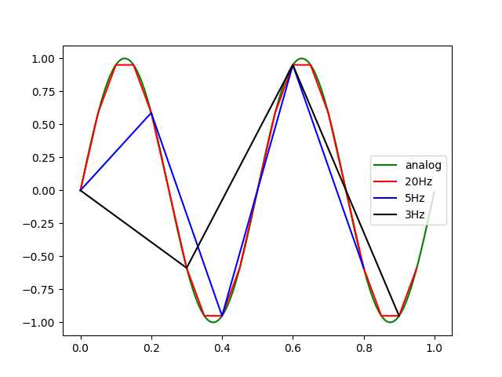

<!-- omit in toc -->
# 応用技術者試験

<!-- omit in toc -->
# 目次
- [第1章 基礎理論](#第1章-基礎理論)
  - [1.1 集合と論理](#11-集合と論理)
    - [集合論理](#集合論理)
    - [命題と論理](#命題と論理)
    - [論理演算](#論理演算)
  - [1.2 情報理論と符号化](#12-情報理論と符号化)
    - [情報量](#情報量)
    - [情報源符号化](#情報源符号化)
    - [ディジタル符号化](#ディジタル符号化)
  - [1.3 オートマトン](#13-オートマトン)
- [第2章 アルゴリズムとプログラミング](#第2章-アルゴリズムとプログラミング)
- [演習](#演習)

# 第1章 基礎理論
コンピュータ学習に置ける基礎事項や知識を養う章

## 1.1 集合と論理
### 集合論理
集合とはある条件を満たし、他のモノとは明確に区別される集まりをさす。

要素数が有限のものを**有限集合**、無限のものを**無限集合**という
また集合の中の要素で作られる集合を**部分集合**といい、ある有限集合の中で作られる部分集合の全ての組み合わせの集合を**べき集合**という

また。集合$a$と$b$があるときに集合$a$の要素であるが$b$の要素ではない集合を**差集合**といい、$a-b$で表される。
逆にどちらかの要素に含まれている集合を**和集合**という

2~3の和集合の要素数は以下の式で表される関係性がある

$A \cup B = A + B - A \cap B$
$A \cup B \cup C = A + B + C - (A \cap B + B \cap C + A \cap C) + A \cap B \cap C$

※ ベン図を書くと分かりやすいが、一回全部の集合の要素を足して、重複した要素を引いたり、引きすぎた要素を足してるだけ

基本的には中高の範囲のベン図の知識で十分なので簡略

### 命題と論理
命題とは一つの判断や主張を記号や文章で表したもので、それが正しいか正しくないかをはっきりと区別できるものを指す
例えば、[$X \cap Y = X$]という命題が合った時、$X=[1] Y=[1,2]$であれば真で、$X=[3] Y=[1,2]$ならば偽である
(こういった命題に変数を含み、その値によって変わる命題を**条件命題**、**命題関数**という)

命題には「かつ」や「又は」などの複数の命題を結んで作られる、**複合命題**、**合成命題**などもある

さらに、複合命題の中でも「pならばq」といった命題を**条件文**といい、$p \rArr q$という風に表す。(⇒は真⇒偽の時のみ偽になる演算子でこれを**含意**という)

また,この式は $\neg (p \cap \neg q) = \neg p \cup q $と同値である ※$\neg$は**否定**
真理値表で表すと以下のような形

| $p$   | $q$   | $p ⇒ q$ | $\neg p \cup q$ |
| --- | --- | ----------- | --------------- |
| 0   | 0   | 1           | 1               |
| 0   | 1   | 1           | 1               |
| 1   | 0   | 0           | 0               |
| 1   | 1   | 1           | 1               |

ある条件文に対して、両方の要素を否定にしたものを**裏**、両方の要素の位置を入れ替えたものを**逆**、両方の要素を否定して入れ替えたものを**対偶**といい、対偶については元の真理値表と一致する性質がある

| $p$   | $q$   | $p ⇒ q$ | $\neg p ⇒ \neg q$ | $q ⇒ p$ | $\neg q ⇒ \neg p$ |
| --- | --- | ----------- | --------------------- | ------------ | --------------------- |
| 0   | 0   | 1           | 1                     |1|1|
| 0   | 1   | 1           | 0                     |0|1|
| 1   | 0   | 0           | 1                     |1|0|
| 1   | 1   | 1           | 1                     |1|1|

これらの事を踏まえて以下の条件から導ける論理的な結論がどちらかを考えてみる。
例題)
> [前提条件]
> 受験生は毎朝、紅茶かコーヒーのどちらかを飲み、両方飲む日はない。紅茶を飲むときは必ずサンドイッチを食べ、コーヒーを飲むときは必ずトーストを食べる
> [結論]
> ①　受験生は朝、サンドイッチを食べるときは紅茶を飲む
> ②　受験生は朝、サンドイッチを食べないならばコーヒーを飲む

①は一見正しそうに見えるが、対偶を考えると「紅茶を飲まないならば、サンドウィッチを食べない」となる。紅茶を飲まない時は条件より必ずコーヒーを飲むが、コーヒーを飲んだ時に、サンドウィッチを食べないという条件はないため、この結論は正しくない
一方②の結論も対偶を考えると、「コーヒーを飲まないならば、サンドウィッチを食べる」となる。コーヒーを飲まない場合、必ず紅茶を飲んでおり、紅茶を飲むときは必ずサンドウィッチを食べるため、これは正しい結論である

### 論理演算
基本論理演算は,論理積(AND)、論理和(OR)、否定(NOT)の3つがあり、この演算を組み合わせる事で様々な論理回路を作成可能
(他に**排他的論理和(XOR)** がよく使われるがこれも3つから作成可能)

交換法則や結合法則は大体四則演算と同等なので特に意識するほどではないが、**ドモルガンの法則**だけは覚えた方が良い

ドモルガンの法則 : 
$\overline{A ・B} = \overline{A} + \overline{B}$
$\overline{A + B} = \overline{A} ・ \overline{B}$

論理式の簡略化には大きくこのドモルガンの法則などの演算測を用いて式変形する場合と**カルノー図**を用いて簡略化する二つの方法がよく用いられる

例) $\overline{A} \cdot \overline{B} + \overline{A} \cdot B + A \cdot \overline{B}$を簡略化

**演算測による簡略化** 
$\overline{A} \cdot \overline{B} + \overline{A} \cdot B + A \cdot \overline{B} =$
$(\overline{A} \cdot \overline{B} + \overline{A} \cdot B) + (A \cdot \overline{B} + \overline{A} \cdot \overline{B} ) =$ ※$\overline{A} \cdot \overline{B}$の同じ集合を複数回足しても結果は同じ
$= \overline{A} + \overline{B} = \overline{A \cdot B}$ 

**カルノー図を用いる方法** 
論理式を図的に書いたものを**カルノー図**と呼ぶ。先ほどの式をカルノー図に当てはめると、以下のようになる
|A\B|0|1|
|---|---|---|
|0|1|1|
|1|1|0|

ここで、図を見ると、B=0の時はAの値に限らず1であり、同様にA=0の時にBの値に限らず1であることが分かる。
このことから$\overline{A} + \overline{B} $を導くことができる

## 1.2 情報理論と符号化
### 情報量
**情報量**とは情報の大きさを定量化した指標で以下の式で表される
$I(J) = - \log_2 P(J)$

情報量は事象が起こる確率が小さい程値が大きくなる性質があり、これはその事象を表現するにはおよそ何bit必要かを測る尺度となる

情報量は加法性があり、独立した事象$J_a,J_b$が同時に行った時の情報量は以下の通りである
$I(J_{ab}) = I(J_{a}) + I(J_{b})$

また、全ての事象の平均的な情報量を**平均情報量(エントロピー)** と言う
$H = \Sigma_{k=1}^{n}{P(J) \times I(J)}$

平均情報量は曖昧さの程度を表しており、平均情報量が小さいほど、曖昧さがなく、予測しやすい事を示しており、逆に大きいと予測するのが難しくなる

例) 天気予報
- 50%で晴れ、50%で雨の天気予報の平均情報量
$H = - \frac{1}{2} \times \log_2{\frac{1}{2}} - \frac{1}{2} \times \log_2{\frac{1}{2}} = 1$
- 100%で晴れの天気予報の平均情報量
$H = -1 \times \log_2{1}  = 0$

### 情報源符号化
情報を正しく伝達するには、正しく伝達するための**通信路符号化**や膨大な情報をできるだけ圧縮するための**情報源符号化**が行われる。

ここでは代表的なハフマン符号化とランレングス符号化について触れる

**ハフマン符号化** 
出現度を元に、出現度の高い文字には短いビット列、小さい文字には長いビット列を割り当てて符号化することで**平均符号長**を圧縮する手法

例) ハフマン符号化手順
まず、これらの文字が以下の確率で出現するとする
|文字|出現頻度|
|---|---|
|a|0.5|
|b|0.3|
|c|0.1|
|d|0.1|

1. 出現頻度の順に文字を並べる

2. この中からか出現頻度が低い二つを選び、出現頻度の大きい方の辺に0を割り当て、もう一方には1を割り当てて、一つにまとめる

3. 以下、全ての要素が一つになるまで、1~2を繰り返す 

4. 各文字、頂点までの経路にある辺の値を上から順に並べたものをその文字の符号として割り当てる

|文字|出現頻度|ハフマン符号化|
|---|---|---|
|a|0.5|0|
|b|0.3|10|
|c|0.1|110|
|d|0.1|111|

実際にハフマン符号化を使用しなかった場合と平均符号長を比較する
まず、4文字を表現するのには2bit必要であるため、ここでは以下のように符号を割り当てる
|文字|符号表記|
|---|---|
|a|00|
|b|10|
|c|01|
|d|11|

この時の平均符号長は
$2 \times 0.5 + 2 \times 0.3 + 2 \times 0.1 + 2 \times 0.1 = 2[bit]$

ハフマン符号化で得た符号を用いた場合の平均符号長は
$1 \times 0.5 + 2 \times 0.3 + 3 \times 0.1 + 3 \times 0.1 = 1.7[bit]$

10文字の文章だった場合、元の方では表現するのに20bit必要だったのが、ハフマン符号化によって17bit程度で表現することができる事が分かる

**ランレングス符号化** 
データ列の上丁度に着目して、同じデータ値が連続する部分をデータ値と反復回数の組みに置き換える圧縮手法

例えば、以下のような文章があるとする
AAAAABCCCCCC
これを次のように置き換える
4A0B5C

数字と文字が同じbit数で表現されていると仮定すると、12文字から6文字に圧縮することが可能

ランレングス符号化は文章だけでなく、画像にも良く使われており、特に0と1で表現される二値化画像においては大幅な圧縮が可能である

### ディジタル符号化
アナログ信号をディジタル信号へと変換する**パルス符号変調(PCM)** について説明する

まず、アナログ信号をディジタル信号に変換するためには以下の3つの手順を順に行う
- **標本化**
- **量子化**
- **符号化**

1. **標本化** 
アナログデータは連続的な信号であるため、連続したデータから、一定間隔でデータを抽出して離散的な信号に変換する操作を**標本化**という 
標本化を行う際は**標本化(サンプリング)定理**に注意する必要がある。標本化定理とは「標本化を行う間隔(**サンプリング周波数**)は元の信号の周波数の2倍以上の周波数でなければならない」という定理である。 
$2f_{ori} \leq f_{samp}$ 
標本化定理を満たしていない場合、元の信号を正しく復元することができなくなってしまう(**エイリアシング**)。
例えば、$\sin{(4\pi t)}$の信号を標本化することを考える。この関数の周波数は2Hzであり、サンプリング周波数は4Hzである。 
ここでサンプリング周波数を3Hzよりすると、いきなりマイナスになり、元のsin波の形状が復元できないことが分かる。
逆に5Hzにした場合、完全とは言わずとも、sin波の上下が分かるようになり、20Hzまで大きくすれば、かなり元の形状に近い形で復元ができている事が分かる。 

また、復元した際にはサンプリング周波数の半分の周波数までしか再現出来ないという性質もあり、この時の復元できる最大の周波数$\frac{1}{2} f_{samp}$を**ナイキスト周波数**と呼ぶ

2. **量子化** 
サンプリングしたデータのアナログ値をディジタル値に変換すすることを**量子化**と呼ぶ。
1つのサンプルデータで生成されるbit数を**量子化ビット数**といい、例えば、量子化ビット数が8ならば、信号の大きさは0~255の$2^8$段階のスケールに変換される
3. **符号化** 
量子化したディジタル値を2進符号形式に変換して符号化ビット列にすることを**符号化**と呼ぶ。
例)
1⇒00000001 32⇒00010000 255⇒11111111

## 1.3 オートマトン

# 第2章 アルゴリズムとプログラミング

# 演習
