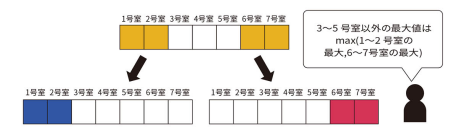

開始日 2023/05/08  
読了日 2023/ * / *  
著者 米田優峻 2022年9月16日初版

# 目次
- [序章 競技プログラミング入門](https://github.com/humiki-kirora/enginner_study/blob/main/%E8%AA%AD%E6%9B%B8/%E7%AB%B6%E6%8A%80%E3%83%97%E3%83%AD%E3%82%B0%E3%83%A9%E3%83%9F%E3%83%B3%E3%82%B0%E3%81%AE%E9%89%84%E5%89%87/%E7%AB%B6%E6%8A%80%E3%83%97%E3%83%AD%E3%82%B0%E3%83%A9%E3%83%9F%E3%83%B3%E3%82%B0%E3%81%AE%E9%89%84%E5%89%87.md#%E5%BA%8F%E7%AB%A0-%E7%AB%B6%E6%8A%80%E3%83%97%E3%83%AD%E3%82%B0%E3%83%A9%E3%83%9F%E3%83%B3%E3%82%B0%E5%85%A5%E9%96%80)
- [1章 アルゴリズムと計算量](https://github.com/humiki-kirora/enginner_study/blob/main/%E8%AA%AD%E6%9B%B8/%E7%AB%B6%E6%8A%80%E3%83%97%E3%83%AD%E3%82%B0%E3%83%A9%E3%83%9F%E3%83%B3%E3%82%B0%E3%81%AE%E9%89%84%E5%89%87/%E7%AB%B6%E6%8A%80%E3%83%97%E3%83%AD%E3%82%B0%E3%83%A9%E3%83%9F%E3%83%B3%E3%82%B0%E3%81%AE%E9%89%84%E5%89%87.md#1%E7%AB%A0-%E3%82%A2%E3%83%AB%E3%82%B4%E3%83%AA%E3%82%BA%E3%83%A0%E3%81%A8%E8%A8%88%E7%AE%97%E9%87%8F)
- [2章 累積和](https://github.com/humiki-kirora/enginner_study/blob/main/%E8%AA%AD%E6%9B%B8/%E7%AB%B6%E6%8A%80%E3%83%97%E3%83%AD%E3%82%B0%E3%83%A9%E3%83%9F%E3%83%B3%E3%82%B0%E3%81%AE%E9%89%84%E5%89%87/%E7%AB%B6%E6%8A%80%E3%83%97%E3%83%AD%E3%82%B0%E3%83%A9%E3%83%9F%E3%83%B3%E3%82%B0%E3%81%AE%E9%89%84%E5%89%87.md#2%E7%AB%A0-%E7%B4%AF%E7%A9%8D%E5%92%8C)
- [3章 二分探索](https://github.com/humiki-kirora/enginner_study/blob/main/%E8%AA%AD%E6%9B%B8/%E7%AB%B6%E6%8A%80%E3%83%97%E3%83%AD%E3%82%B0%E3%83%A9%E3%83%9F%E3%83%B3%E3%82%B0%E3%81%AE%E9%89%84%E5%89%87/%E7%AB%B6%E6%8A%80%E3%83%97%E3%83%AD%E3%82%B0%E3%83%A9%E3%83%9F%E3%83%B3%E3%82%B0%E3%81%AE%E9%89%84%E5%89%87.md#3%E7%AB%A0-%E4%BA%8C%E5%88%86%E6%8E%A2%E7%B4%A2)
- [4章 動的計画法](https://github.com/humiki-kirora/enginner_study/blob/main/%E8%AA%AD%E6%9B%B8/%E7%AB%B6%E6%8A%80%E3%83%97%E3%83%AD%E3%82%B0%E3%83%A9%E3%83%9F%E3%83%B3%E3%82%B0%E3%81%AE%E9%89%84%E5%89%87/%E7%AB%B6%E6%8A%80%E3%83%97%E3%83%AD%E3%82%B0%E3%83%A9%E3%83%9F%E3%83%B3%E3%82%B0%E3%81%AE%E9%89%84%E5%89%87.md#4%E7%AB%A0-%E5%8B%95%E7%9A%84%E8%A8%88%E7%94%BB)
- [5章 数学的問題](https://github.com/humiki-kirora/enginner_study/blob/main/%E8%AA%AD%E6%9B%B8/%E7%AB%B6%E6%8A%80%E3%83%97%E3%83%AD%E3%82%B0%E3%83%A9%E3%83%9F%E3%83%B3%E3%82%B0%E3%81%AE%E9%89%84%E5%89%87/%E7%AB%B6%E6%8A%80%E3%83%97%E3%83%AD%E3%82%B0%E3%83%A9%E3%83%9F%E3%83%B3%E3%82%B0%E3%81%AE%E9%89%84%E5%89%87.md#5%E7%AB%A0-%E6%95%B0%E5%AD%A6%E7%9A%84%E5%95%8F)
- [6章 考察テクニック](https://github.com/humiki-kirora/enginner_study/blob/main/%E8%AA%AD%E6%9B%B8/%E7%AB%B6%E6%8A%80%E3%83%97%E3%83%AD%E3%82%B0%E3%83%A9%E3%83%9F%E3%83%B3%E3%82%B0%E3%81%AE%E9%89%84%E5%89%87/%E7%AB%B6%E6%8A%80%E3%83%97%E3%83%AD%E3%82%B0%E3%83%A9%E3%83%9F%E3%83%B3%E3%82%B0%E3%81%AE%E9%89%84%E5%89%87.md#6%E7%AB%A0-%E8%80%83%E5%AF%9F%E3%83%86%E3%82%AF%E3%83%8B%E3%83%83%E3%82%AF)
- [7章 ヒューリスティック](https://github.com/humiki-kirora/enginner_study/blob/main/%E8%AA%AD%E6%9B%B8/%E7%AB%B6%E6%8A%80%E3%83%97%E3%83%AD%E3%82%B0%E3%83%A9%E3%83%9F%E3%83%B3%E3%82%B0%E3%81%AE%E9%89%84%E5%89%87/%E7%AB%B6%E6%8A%80%E3%83%97%E3%83%AD%E3%82%B0%E3%83%A9%E3%83%9F%E3%83%B3%E3%82%B0%E3%81%AE%E9%89%84%E5%89%87.md#7%E7%AB%A0-%E3%83%92%E3%83%A5%E3%83%BC%E3%83%AA%E3%82%B9%E3%83%86%E3%82%A3%E3%83%83%E3%82%AF)
- [8章 データ構造とクエリ処理](https://github.com/humiki-kirora/enginner_study/blob/main/%E8%AA%AD%E6%9B%B8/%E7%AB%B6%E6%8A%80%E3%83%97%E3%83%AD%E3%82%B0%E3%83%A9%E3%83%9F%E3%83%B3%E3%82%B0%E3%81%AE%E9%89%84%E5%89%87/%E7%AB%B6%E6%8A%80%E3%83%97%E3%83%AD%E3%82%B0%E3%83%A9%E3%83%9F%E3%83%B3%E3%82%B0%E3%81%AE%E9%89%84%E5%89%87.md#8%E7%AB%A0-%E3%83%87%E3%83%BC%E3%82%BF%E6%A7%8B%E9%80%A0%E3%81%A8%E3%82%AF%E3%82%A8%E3%83%AA%E5%87%A6%E7%90%86)
- [9章 グラフアルゴリズム](https://github.com/humiki-kirora/enginner_study/blob/main/%E8%AA%AD%E6%9B%B8/%E7%AB%B6%E6%8A%80%E3%83%97%E3%83%AD%E3%82%B0%E3%83%A9%E3%83%9F%E3%83%B3%E3%82%B0%E3%81%AE%E9%89%84%E5%89%87/%E7%AB%B6%E6%8A%80%E3%83%97%E3%83%AD%E3%82%B0%E3%83%A9%E3%83%9F%E3%83%B3%E3%82%B0%E3%81%AE%E9%89%84%E5%89%87.md#9%E7%AB%A0-%E3%82%B0%E3%83%A9%E3%83%95%E3%82%A2%E3%83%AB%E3%82%B4%E3%83%AA%E3%82%BA%E3%83%A0)
- [10章 総合問題](https://github.com/humiki-kirora/enginner_study/blob/main/%E8%AA%AD%E6%9B%B8/%E7%AB%B6%E6%8A%80%E3%83%97%E3%83%AD%E3%82%B0%E3%83%A9%E3%83%9F%E3%83%B3%E3%82%B0%E3%81%AE%E9%89%84%E5%89%87/%E7%AB%B6%E6%8A%80%E3%83%97%E3%83%AD%E3%82%B0%E3%83%A9%E3%83%9F%E3%83%B3%E3%82%B0%E3%81%AE%E9%89%84%E5%89%87.md#10%E7%AB%A0-%E7%B7%8F%E5%90%88%E5%95%8F%E9%A1%8C)
- [終章 さらに上達するには](https://github.com/humiki-kirora/enginner_study/blob/main/%E8%AA%AD%E6%9B%B8/%E7%AB%B6%E6%8A%80%E3%83%97%E3%83%AD%E3%82%B0%E3%83%A9%E3%83%9F%E3%83%B3%E3%82%B0%E3%81%AE%E9%89%84%E5%89%87/%E7%AB%B6%E6%8A%80%E3%83%97%E3%83%AD%E3%82%B0%E3%83%A9%E3%83%9F%E3%83%B3%E3%82%B0%E3%81%AE%E9%89%84%E5%89%87.md#%E7%B5%82%E7%AB%A0-%E3%81%95%E3%82%89%E3%81%AB%E4%B8%8A%E9%81%94%E3%81%99%E3%82%8B%E3%81%AB%E3%81%AF)


# 序章 競技プログラミング入門

## 競技プログラミングとは
プログラミングの問題を解くことを競技にしたもので「競プロ」と言われるもの  
約15年程度前に本格的に始まった競技だが、現在国内だけで3万人程度のアクティブユーザがおり、中高生からプログラマまで幅広い層が参加しており、コーディングスキル向上や教育などの目的で利用されることも多い

## コンテストの種類
- AtCoder (https://atcoder.jp/?lang=ja)  
日本最大手のプログラミングコンテスト  毎週末21時からオンラインで開催  
コンテストの成績に応じたレーティングがつけられるという特徴があり、強さの照明になるという点で、技術系のアルバイトや就職活動に利用されることもある  

- 日本情報オリンピック(JOI)  
高校生以下を対象とするコンテスト  
毎年1500人程度が参加して4人まで絞り、日本代表として世界大会に出場できる  
自分には関係のないことなので省略

- 大学対抗プログラミングコンテスト(ICPC)  
ICPC Foundationが開催する大学生向けのコンテスト  
3人チームでの参加のため、AtCoderと違って戦略とチームワークが重要  
自分には関係のないことなので省略  

- Google Code Jam  
Google社が毎年開催している競技プログラミングの大会  
世界各地から毎年2万人程度が予選に参加  
2時間半で3~4問解く形式で行われて、3回の予選を勝ち抜いた上位25人は現地で行われる決勝戦に参加できる

- アルゴリズム実技検定(PAST)(https://past.atcoder.jp/)  
日本初のアルゴリズム構築能力を測る検定試験  
AtCoder社が主催しており、検定料は8800円と金がかかるが、基準点に達した場合は「アルゴリズムができる人材」の証明になるため、市場価値のアップに繋がる

この中ではAtCoder、Google Code Jam、アルゴリズム実技検定(PAST)が自分には関係ありそう  

## 競技プログラミングで求められること
- プログラミング能力  
プログラミングを書く必要があるので、どれかの一つの言語について必要な機能を利用して希望通りの機能を素早くコーディングする能力が求められる

- アルゴリズムの知識  
競技プログラミングでは処理時間の制約があり、正しい答えを出すだけでは不十分な場合がある  
そのため、より効率的に答えを導き出すための典型的なアルゴリズムを学ぶ必要がある

- 思考力・発想力  
競技プログラミングで出題される問題はアルゴリズムの知識だけで解けるとは限らない  
問題を上手く分解したり、規則性に着目したりなどの発想力やひらめきが要求されることもある  
また複雑な問題を整理して解き切るために必要な論理的思考力も重要

## 本書の進め方
- 読み方
全部で10章で構成されており、1章で競技プログラミングで戦う上での基礎となるアルゴリズムや計算量について概観する。  
2~9章以降は頻出の典型アルゴリズムや考察テクニックについて触れている  
それぞれ独立しているため、どこから始めても大丈夫

- 例題・応用問題・力試し問題  
★1~6の難易度の問題が用意されており、難易度が高いほど知識や応用力が必要になる

- 自動採点システム (https://atcoder.jp/contests/tessoku-book)  
本書の例題・応用問題・力試し問題を正しいか機械的に判定する自動採点システムがあるため利用可能

# 1章 アルゴリズムと計算量  

## アルゴリズムとは
アルゴリズムとは問題を解くための**計算の手順**のこと  
同じ問題を解くとしても複数のアルゴリズムが考えられ、効率の良し悪しが異なる場合がある

### 具体例1 1+2+...+50を計算
一番ナイーブな方法としては1から順に足し算を行う方法でこれでも正解の1275を求める事ができる  
ただし、足し算を49回行う必要があり、計算するのが大変である  

そこで、以下のように考える
```
 1 + 2 + 3 + ... + 50 = (1 + 50) + (2 + 49) + (3 + 48) + ... + (25 + 26) = 51 * 25 
```
このように51が25個存在しているという風に考えることで、一回の掛け算の計算で答えを得ることができ、効率的に計算が可能  

### 具体例2 迷路の最短手数
以下の迷路の最短経路を求めることを考える  


一番ナイーブな方法としてはスタート地点から出発する全ての経路について調べることで**全探索**と呼ばれている方法  
ただし、この規模の迷路ですら経路数は15万通り以上の経路を調べる必要があり、コンピュータの力を借りなければ到底実現できない  

そこでより良い解放を考える  
まず、スタート地点を「0」として書き込み、その隣接している経路に「1」と書き込む  
その後、同様に隣接していてまだ数字が書かれていない経路に2,3,...と順に書き込む操作を行うと最終的に以下のような結果が得られる  


このようにすることで、ゴールまでの最短手数20が計算されるので、ゴールから順に20⇒19⇒18と辿っていくことで全探索よりも少ない探索で最短経路を得ることができる  
このアルゴリズムは**幅優先探索**と呼ばれている(第9章で扱う)  

このように同じ問題を解くにしても複数のアルゴリズムがあり、効率が大きく異なる  

## 計算量
アルゴリズムによって効率が変化するのは分かったが、アルゴリズムの効率をどのように評価するべきか  
どこで用いられるのが**計算量**という概念

計算量はアルゴリズムの効率を評価する1つの指標であり、*O*記法を用いて*O(N)*,*O(N^2)*,*O(2^N)*等の形で表され次のような意味を持つ

|  計算量  |  意味  |
| ---- | ---- |
|  O(N)  |  計算回数が概ねNに比例する  |
|  O(N^2)  |  計算回数が概ねN^2に比例する  |
|  O(2^N)  |  計算化数が概ね2^Nに比例する  |

### 計算量の例
先ほどの[具体例1]()で説明した1ずつ足していく方法はN - 1回の足し算が必要なので計算量は*O(N)*
それに対し、工夫した解法の方は1回の掛け算で済むため、*O(1)*となる

このように*O*記法では大まかな計算回数を表している

### 計算量の目安
各計算量における計算回数とNの関係を以下の表に示す  
家庭用PCの計算速度は毎秒10億回程度であるため、10^9を超える部分は赤色になっている  
競技プログラミングにおいては、赤色で塗られた部分については正解となる可能性は低い


## 第1章のゴール
次に全5問の例題を通して、アルゴリズムと計算量に関する理解と競技プログラミングの問題形式に慣れることを目指す  

## 1.1 導入問題
### A01 Thre First Problem ★1
問題文:https://atcoder.jp/contests/tessoku-book/tasks/tessoku_book_a

特に何も難しいことはないのでそのまま解ける
```C++
#include <bits/stdc++.h>
using namespace std;
 
int main(){
  int N;
  cin >> N;
  cout << N * N << endl;
  return 0;
}
```


### B01 A+B Problem
問題文:https://atcoder.jp/contests/tessoku-book/tasks/tessoku_book_bz  

特に何も難しいことはないのでそのまま解ける
```C++
#include <bits/stdc++.h>
using namespace std;
 
int main(){
  int A,B;
  cin >> A >> B;
  cout << A + B << endl;
  return 0;
}
```

## 1.2 全探索(1) ★1
**全探索**は有り得る全てのパターンを調べ上げる方針で問題を解く方法  
Ex)4桁の暗証番号を0000~9999までのすべての番号を試す  
一番シンプルで確実に解けるが、時間的には効率が悪い
### A02 Linear Search
問題文:https://atcoder.jp/contests/tessoku-book/tasks/tessoku_book_b  

set<>を使うと重複を避けられる
```C++
#include <bits/stdc++.h>
using namespace std;
 
int main(){
  int N,X;
  cin >> N >> X;

  set<int> A;
  for(int i = 0; i < N; i ++) {
    int tmp;
    cin >> tmp;
    A.insert(tmp);
  }

  if(find(A.begin(),A.end(),X) != A.end()){
    cout << "Yes" << endl;
  }
  else {
    cout<< "No" << endl;
  }

  return 0;
}
```

## 1.3 全探索(2)
### A03 Two Cards ★1
問題文:https://atcoder.jp/contests/tessoku-book/tasks/tessoku_book_c  

P+Qのパターンを二重ループで全て試すと正解できる
```C++
#include <bits/stdc++.h>
using namespace std;
 
int main(){
    int N,K;

    cin >> N >> K;
    vector<int> P(N),Q(N);

    for(int i = 0; i < N; i ++) cin >> P[i];
    for(int i = 0; i < N; i ++) cin >> Q[i];

    for(int i = 0; i < N; i ++){
        for(int j = 0; j < N; j ++){
            if(K == P[i] + Q[j]){
                cout << "Yes" << endl;
                return 0;
            }
        }
    }

    cout << "No" << endl;
    return 0;
}
```

### B03 Supermarket 1
問題文:https://atcoder.jp/contests/tessoku-book/tasks/tessoku_book_cb

3重ループで全パターンを試す
```C++
#include <bits/stdc++.h>
using namespace std;
 
int main(){
    int N;
    cin >> N;

    vector<int> A(N);
    for(auto & a : A) cin >> a;

    for(int i = 0; i < N - 2; i ++){
        for(int j = i + 1; j < N - 1; j ++){
            for(int k = j + 1; k < N; k ++){
                if(A[i] + A[j] + A[k] == 1000){
                    cout << "Yes" << endl;
                    return 0;
                }
            }
        }
    }

    cout << "No" << endl;
    return 0;
}
```
## 1.4 2進法
### A04 Binary Representation 1 ★2
問題文:https://atcoder.jp/contests/tessoku-book/tasks/tessoku_book_d

普通に10進数を2進数に変更する方法を試す
```C++
#include <bits/stdc++.h>
using namespace std;
 
int main(){
    int N;
    cin >> N;

    vector<int> ans;
    int tmpN = N;
    while( (tmpN / 2) != 0){
        ans.push_back(tmpN % 2);
        tmpN = tmpN / 2;
    }
    ans.push_back(1);

    //0埋め
    for(int i = 0; i < 10 - ans.size(); i++) cout << 0;

    for(int i = ans.size() - 1; i >= 0; i --){
        cout << ans[i];
    }
    cout << endl;

    return 0;
}
```

**別解**  
対象の数字を2^n(n=0~9)までの数で割った余りを表示すれば簡単に解ける　　
```C++
#include <bits/stdc++.h>
using namespace std;
 
int main(){
    int N;
    cin >> N;

    for(int i = 9; i >= 0; i --){
        int num = (1 << i);
        cout << (N / num) % 2;
    }
    cout << endl;

    return 0;
}
```

### B04 Binary Representation 2
問題文:https://atcoder.jp/contests/tessoku-book/tasks/tessoku_book_cc

2⇒10進数変換では10で割った余りを用いて、位に応じてシフトしたものの合計を計算すればよい
```C++
#include <bits/stdc++.h>
using namespace std;
 
int main(){
    int N;
    cin >> N;

    int ans = 0;
    int count = 0;
    while(N > 0){
        ans += (( N % 10) << count);
        count ++;
        N /= 10;
    }

    cout << ans << endl;
    return 0;
}
```
### 1.5 チャレンジ問題 ★2
問題文:https://atcoder.jp/contests/tessoku-book/tasks/tessoku_book_e

2枚のカードが決まれば3枚目は自動的に決まるので2重ループの探索で求まる
```C++
#include <bits/stdc++.h>
using namespace std;
 
int main(){
    int N,K;
    cin >> N >> K;
    int ans = 0;

    for(int r = 1; r <= N; r ++){
        for(int b = 1; b <= N; b ++){
            if(K - (r + b) > N || K - (r + b) < 1) continue;
            ans ++;
        }
    }

    cout << ans << endl;
    return 0;
}
```

### ビット全探索
本格的な全探索問題として、以下の部分和問題を考える
> N枚のカードがあり、1からNまでの番号がつけられている。
> カードiには整数Aiが描かれており、カードの中からいくつか選び、書かれた整数の合計がSとなるような方法があるかを判定する

この問題では、N=20程度の小さい値であれば、全探索で解くことが可能だが、  
単純に実装すると、N重のfor文が必要になるため実装がめんどくさい  

2進数を用いることで、カードの選び方を0以上2^N - 1以下の整数値に対応させることが可能


これにより、部分和問題を解くプログラムを簡単に実装可能

```C++
#include <bits/stdc++.h>
using namespace std;
 
int main(){
    int N,K;
    cin >> N >> K;
    
    vector<int> A(N);
    for(auto & a : A) cin >> a;

    int pattern = (1 << N);

    //0~2^N - 1の全パターンを探索
    for(int i = 0; i < pattern; i ++){
      int ans = 0;

      //iを2進数に変換して、1の箇所を足す
      for(int j = 0; j < N; j ++){
        int div = (i / (1 << j));
         if(div % 2 == 1) ans += A[j];
      }

      //一致すれば終了
      if(A[j] == K){
        cout << "Yes" << endl;
        return 0;
      }
    }

    cout << "No" << endl;
    return 0;
}
```

# 2章 累積和
## 2.0 累積和とは
最初に、以下の計算問題を考える
> ある遊園地では、1月前半の来場者数が以下の表のようになった。
> 4-13、3-10、2-15までの総来場者数を計算してください
 


単純に考えるならば、1/4~1/13までの来場者数の総和をそのまま計算するだけで良いが、
これは面倒な上、他の期間の計算でも同じような計算が必要になり効率が悪い

そこで以下の表のように1月1日からの累積来場者数を前もって計算する


この表を前もって計算しておくことで、以下の一回の引き算で期間の総来場者数を求めることができる
- 1/4~13の総来場者数　= 1/13時点の累積来場者数 - 1/3時点の累積来場者数
- 1/3~10の総来場者数　= 1/10時点の累積来場者数 - 1/2時点の累積来場者数
- 1/2~15の総来場者数　= 1/15時点の累積来場者数 - 1/1時点の累積来場者数

このように配列の先頭からの累積値を記録した累積和を前もって計算しておくと効率的に範囲の合計を計算できるようになる

## 2.1 一次元の累積和(1)
### A06 How Many Guests? ★2
問題文:https://atcoder.jp/contests/tessoku-book/tasks/math_and_algorithm_ai

そのままAの累積和を計算してから、引き算を行う  
累積和の日にちを0日目から計算することで、if文を使わずにスムーズに計算可能
```C++
#include <bits/stdc++.h>
using namespace std;
 
int main(){
    int N,Q;
    cin >> N >> Q;

    vector<int> A(N);
    for(auto & a : A) cin >> a;

    vector<int> cumsum(N + 1,0);
    cumsum[0] = 0;
    for(int i = 1; i < N + 1; i ++){
        cumsum[i] = cumsum[i - 1] + A[i - 1];
    }

    vector<pair<int,int>> Question(Q);
    for(auto & q : Question) cin >> q.first >> q.second;

    for(int i = 0; i < Q; i ++){
        int l = Question[i].first;
        int r = Question[i].second;
        cout << cumsum[r] - cumsum[l - 1] << endl;
    }

    return 0;
}
```

### B06 Lottery
問題文:https://atcoder.jp/contests/tessoku-book/tasks/tessoku_book_ce

当たりの累積和を計算して、その区間の当たりの数を計算  
その後、その区間の日数と当たりの数を照らし合わせて判定すればよい
```C++
#include <bits/stdc++.h>
using namespace std;
 
int main(){
    int N,Q;
    cin >> N;

    vector<int> A(N);
    for(auto & a : A) cin >> a;

    vector<int> cumsum(N+1);
    cumsum[0] = 0;
    for(int i = 1; i < N + 1; i ++){
        cumsum[i] = cumsum[i - 1] + A[i - 1]; 
    }

    cin >> Q;
    vector<pair<int,int>> question(Q);
    for(auto & q : question) cin >> q.first >> q.second;

    for(auto & q : question){
        int l = q.first;
        int r = q.second;
        int hit = cumsum[r] - cumsum[l - 1];
        int no_hit = (r - l + 1) - hit;
        if(hit == no_hit) cout << "draw" << endl;
        else if(hit > no_hit) cout << "win" << endl;
        else cout << "lose" << endl;
    }


    return 0;
}
```

## 2.2 一次元の累積和
### A07 Event Attendance ★3
問題文:https://atcoder.jp/contests/tessoku-book/tasks/tessoku_book_g

普通にやると、各人の参加日程を調べて、その日程分プラスしていくという処理が必要になるが  
日程が多いとそれだけで処理時間がかなり増えてしまい時間切れになる  
例えば、D = 10^5日でN = 10^5人が全日参加した時、D * N　= 10^10回の加算処理が行われる  
<br>
そこで、前日比を考えて、**前日比の累積和**を取ることで効率的に解くことができる  
まず、参加者の最初の参加日をL日目、最終日をR日目として、
L日目に1人増えるので+1,R - 1日は1人減るので-1という風に記録していき、この処理を全ての参加者に対して行う事で前日比を算出できる
<br>  
前日比なので、0日目を0人として前日比の累積和を計算すると、各日の参加者の数を算出することができる

ここで先ほどのD=10^5 N=10^5の例との計算量を比較してみる  
前日比の累積和を使用したアルゴリズムでは以下の計算が行われる
- 1人に対して加算回数は2回だけなので、10^5 * 2
- 累積和を計算するのに、10^5回の加算処理

そのため、加算回数は```10^5 * 2 + 10^5 = 10^5 * 3 < 10^10```となり、より少ない計算回数で問題を解く事が可能となる

```C++
#include <bits/stdc++.h>
using namespace std;
 
int main(){
    int D,N;
    cin >> D >> N;

    vector<pair<int,int>> person(N);
    for(auto & p : person) cin >> p.first >> p.second;

    vector<int> ratio(D + 2,0),cumsum(D + 2,0);
    for(auto & p : person){
        int l = p.first;
        int r = p.second;
        ratio[l] ++;
        ratio[r + 1] --;
    }

    cumsum[0] = 0;
    for(int i = 1; i < D + 1; i ++){
        cumsum[i] = ratio[i] + cumsum[i - 1];
    }

    for(int i = 1; i < D + 1; i ++){
        cout << cumsum[i] << endl;
    }
    
    return 0;
}
```

### B07 Convenience Store 2
問題文:https://atcoder.jp/contests/tessoku-book/tasks/math_and_algorithm_al  

A07と基本的には同じように解く  
今回は前日比の代わりに、先に時刻Tにおける人数の増減を記録することで、
累積和で時刻T~T+1の間に出勤している人数を求める事ができる

```C++
#include <bits/stdc++.h>
using namespace std;
 
int main(){
    int T,N;
    cin >> T >> N;

    vector<pair<int,int>> person(N);
    for(auto &p : person) cin >> p.first >> p.second;

    vector<int> rate(T+2,0);

    for(int i = 0; i < person.size(); i ++){
        rate[person[i].first + 1] ++;
        rate[person[i].second + 1] --;
    }

    vector<int> cumsum(T+2,0);
    for(int i = 1; i < T + 2; i++){
        cumsum[i] = cumsum[i - 1] + rate[i];
    }

    for(int i = 1; i < T + 1; i ++){
        cout << cumsum[i] << endl;
    }

    return 0;
}
```

## 2.3 二次元の累積和
### A08 Two DImensional Sum ★4
問題文:https://atcoder.jp/contests/tessoku-book/tasks/tessoku_book_h  

累積和は1次元だけでなく、2次元にも適用することが可能  
二次元の累積を取る場合は、先に行方向の累積和を計算し、その計算結果を元に列方向の累積和を計算することで、
座標(1,1)から座標(a,b)の矩形の全ての要素の和を座標(a,b)に計算することができる  
この累積和を元に任意の座標(a,b)と座標(c,d)内の累積和がを求める場合は以下のように求める事が可能

```
座標(c,d)の累積和 - (座標(c,b -1)の累積和 + 座標(a - 1,d)の累積和 - 座標(a-1 , b-1)の累積和)
```

具体的には以下のようなイメージの計算が行われる  
重複する部分があるため、その分を引きすぎないように注意が必要<br>


```C++
#include <bits/stdc++.h>
using namespace std;
 
int main(){
    int H,W;
    cin >> H >> W;
    vector<vector<int>> matrix(H,vector<int>(W,0));

    for(auto & row : matrix)
        for(auto & col : row) cin >> col;

    int Q;
    cin >> Q;
    vector<vector<int>> question(Q,vector<int>(4,0));

    for(auto & row : question)
        for(auto & col : row) cin >> col;
    
    vector<vector<int>> cumsum(H + 1,vector<int>(W + 1,0));
    for(int i = 1; i < H + 1 ; i ++){
        for(int j = 1; j < W + 1; j ++){
            cumsum[i][j] = cumsum[i][j - 1] + matrix[i - 1][j - 1];
        }
    }

    for(int i = 1; i < H + 1 ; i ++){
        for(int j = 1; j < W + 1; j ++){
            cumsum[i][j] = cumsum[i][j] + cumsum[i - 1][j];
        }
    }

    for(auto & q : question){
        cout << cumsum[q[2]][q[3]] - (cumsum[q[2]][q[1] - 1] + cumsum[q[0] - 1][q[3]] - cumsum[q[0] - 1][q[1] - 1]) << endl;
    }

    return 0;
}
```

### B08 Counting Points
問題文:https://atcoder.jp/contests/tessoku-book/tasks/tessoku_book_cg  

A08同様に二次元累積和を計算すれば計算可能
```C++
#include <bits/stdc++.h>
using namespace std;

//二次元行列デバッグ用関数
void print_2Dmatrix(vector<vector<int>> & matrix){
    for(int i = 0; i < matrix.size(); i ++){
        for(int j = 0; j < matrix[0].size(); j ++){
            cout << matrix[i][j] << " ";
        }
        cout << endl;
    }
}
 
int main(){
    int N;
    cin >> N;

    vector<int> cood_x(N);
    vector<int> cood_y(N);
    for(int i = 0; i < N; i ++) cin >> cood_x[i] >> cood_y[i];

    //行列の範囲を計算
    int max_x = *max_element(cood_x.begin(),cood_x.end());
    int max_y = *max_element(cood_y.begin(),cood_y.end());

    int Q;
    cin >> Q;
    vector<vector<int>> rect(Q,vector<int>(4,0));
    for(auto & r : rect) cin >> r[0] >> r[1] >> r[2] >> r[3];

    //二次元累積和の計算
    vector<vector<int>> matrix(max_y,vector<int>(max_x,0));
    vector<vector<int>> cumsum(max_y + 1,vector<int>(max_x + 1,0));

    for(int i = 0; i < N; i ++){
        matrix[cood_y[i] - 1][cood_x[i] - 1]++;
    }

    for(int h = 1; h < max_y + 1; h ++){
        for(int w = 1; w < max_x + 1; w ++){
            cumsum[h][w] = cumsum[h][w - 1] + matrix[h - 1][w - 1]; 
        }
    }

    for(int h = 1; h < max_y + 1; h ++){
        for(int w = 1; w < max_x + 1; w ++){
            cumsum[h][w] = cumsum[h][w] + cumsum[h - 1][w]; 
        }
    }

    //答えの出力
    for(auto & r : rect){
        int ans = cumsum[r[3]][r[2]] - (cumsum[r[3]][r[0] - 1] + cumsum[r[1] - 1][r[2]]) + cumsum[r[1] - 1][r[0] - 1];
        cout << ans << endl;
    }

    return 0;
}
```

## 2.4 二次元の累積和(2)
### A09 Winter in ALGO Kingdom ★4
問題文:https://atcoder.jp/contests/tessoku-book/tasks/tessoku_book_i

前日比の累積和の応用で解くことが可能  
以下の画像を例に説明すると、(2,2) ~ (4,4)の範囲に雪が降ったとする<br>
その場合、(2,2)と(5,5)に+1,(2,5)と(5,2)に-1を加算すると、その二次元の累積和を計算すると、丁度(2,2) ~ (4,4)の範囲に雪が積持っていることを確認する事が計算できる。  


二日目以降も同様に前日との差分を記録していくことで、累積和を取った時に現在の積雪量を復元することができるため、この方法で問題を解くことができる。

```C++
#include <bits/stdc++.h>
using namespace std;

void print_2Dmatrix(vector<vector<int>> & matrix){
    for(int i = 0; i < matrix.size(); i ++){
        for(int j = 0; j < matrix[0].size(); j ++){
            cout << matrix[i][j] << " ";
        }
        cout << endl;
    }
}
 
int main(){
    int N, H, W;
    cin >> H >> W >> N;

    vector<vector<int>> matrix(H + 1,vector<int>(W + 1,0));

    for(int i = 0; i < N; i++){
        int c[4];
        cin >> c[0] >> c[1] >> c[2] >> c[3];

        matrix[c[0] - 1][c[1] - 1] ++;
        matrix[c[0] - 1][c[3]] --;
        matrix[c[2]][c[1] - 1] --;
        matrix[c[2]][c[3]] ++;
    }

    vector<vector<int>> cumsum(H + 1,vector<int>(W + 1,0));

    for(int h = 1; h < H + 1; h ++){
        for(int w = 1; w < W + 1; w ++){
            cumsum[h][w] = cumsum[h][w - 1] + matrix[h - 1][w - 1];
        }
    }

    for(int h = 1; h < H + 1; h ++){
        for(int w = 1; w < W + 1; w ++){
            cumsum[h][w] = cumsum[h][w] + cumsum[h - 1][w];
        }
    }

    for(int i = 1; i < H + 1; i ++){
        for(int j = 1; j < W; j ++){
            cout << cumsum[i][j] << " ";
        }
        cout << cumsum[i][W] << endl;
    }

    return 0;
}
```
### B09 Papers
問題文:https://atcoder.jp/contests/tessoku-book/tasks/tessoku_book_ch

A09同様二次元配列の前回比を考えると解くことができる。  
座標の扱いで少し苦戦したので、実際に図に落として考えてみると整理しやすいかもしれない

```C++
#include <bits/stdc++.h>
using namespace std;
 
void print_2Dmatrix(vector<vector<int>> & matrix){
    for(int i = 0; i < matrix.size(); i ++){
        for(int j = 0; j < matrix[0].size(); j ++){
            cout << matrix[i][j] << " ";
        }
        cout << endl;
    }
}
 
int main(){
    int N;
    cin >> N;
 
    vector<vector<int>> coods(N,vector<int>(4,0));
 
    int max_x = 0;
    int max_y = 0;
 
    for(auto & c : coods){
        cin >> c[0] >> c[1] >> c[2] >> c[3];
        max_x = max(max_x,c[2]);
        max_y = max(max_y,c[3]);
    }
 
    int H = max_y;
    int W = max_x;
 
    vector<vector<int>> matrix(H + 2,vector<int>(W + 2,0));
    vector<vector<int>> cumsum(H + 2,vector<int>(W + 2,0));
 
    for(auto &c : coods){
        matrix[c[1]][c[0]] ++;
        matrix[c[1]][c[2]] --;
        matrix[c[3]][c[0]] --;
        matrix[c[3]][c[2]] ++;   
    }
 
    for(int h = 1; h < H + 2; h ++){
        for(int w = 1; w < W + 2; w ++){
            cumsum[h][w] = cumsum[h][w - 1] + matrix[h - 1][w - 1];
        }
    }
 
    for(int h = 1; h < H + 2; h ++){
        for(int w = 1; w < W + 2; w ++){
            cumsum[h][w] = cumsum[h][w] + cumsum[h - 1][w];
        }
    }
 
    int ans = 0;
    for(int h = 1; h < H + 2; h ++){
        for(int w = 1; w < W + 2; w ++){
            if (cumsum[h][w] != 0) ans++;
        }
    }
 
    cout << ans << endl;
 
    return 0;
}
```

## 2.5 チャレンジ問題
### A10 Resort Hotel ★4
問題文:https://atcoder.jp/contests/tessoku-book/tasks/tessoku_book_j<br>

累積和の応用で解くことが可能<br>
以下の図で説明すると、このように使用できない範囲が決まっている場合、この状況での最大値は、`max(1~2号室の最大値、6~7号室の最大値)`で求める事が可能<br>
その為、予め1~2号室、6~7号室の最大値が計算できていればO(1)で解くことが可能になる。<br>


この場合、左から順にそれまでの範囲の最大値を計算した結果と、右側から順にそれまでの範囲の最大値を計算した結果を保持しておくことで、任意の範囲の最大値を即座に求める事ができる<br>


```C++
int main(){
    int N;
    cin >> N;

    vector<int> A(N);
    for(auto & a : A) cin >> a;

    int D;
    cin >> D;
    vector<int> L(D);
    vector<int> R(D);
    for(int i = 0; i < D; i ++){
        cin >> L[i] >> R[i];
    }

    vector<int> L_max(N,0);
    vector<int> R_max(N,0);

    L_max[0] = A[0];
    for(int i = 1; i < N; i ++){
        L_max[i] = max(A[i],L_max[i - 1]);
    }

    R_max[N - 1] = A[N - 1];
    for(int i = N - 2; i > 0; i --){
        R_max[i] = max(A[i],R_max[i + 1]);
    }

    for(int i = 0; i < D; i ++){
        cout << max(L_max[L[i] - 1 - 1],R_max[R[i]]) << endl;
    }


    return 0;
}
```

# 3章 二分探索

# 4章 動的計画
## 4.0 動的計画法とは
**動的計画法**とはより小さい問題の結果を利用して問題を解く方法の総称であり、よくDP(Dynamic Programming)と略して呼ばれる事が多い<br>

例えば以下のような問題があるとする
> あるダンジョンには5つの部屋がある。このダンジョンでは、通路を介して、1つ先または二つ先の部屋に移動することが可能。
> 部屋1から部屋5まで移動するのに、最短何分かかるかを求めよ


この問題を解く最もシンプルな方法は、移動経路全てを全探索する事で今回は部屋の数が5つと少ないので、取りうる経路は以下の5通りしかなく、簡単に求める事ができる<br>
- 1⇒2⇒3⇒4⇒5
- 1⇒2⇒4⇒5
- 1⇒2⇒3⇒5
- 1⇒3⇒4⇒5
- 1⇒3⇒5

しかし、部屋の数が増えると移動経路の数が指数関数的に増加するため、
効率の良い探索方法とは言えない<br>

そこで、いきなり部屋1から5までの最短経路を出すのではなく、以下のような順序で問題を考えてみる事にする
- 部屋1から部屋1までの最短時間dp[1]
- 部屋1から部屋2までの最短時間dp[2]
- 部屋1から部屋3までの最短時間dp[3]
- 部屋1から部屋4までの最短時間dp[4]
- 部屋1から部屋5までの最短時間dp[5]

すると以下のような流れで解くことかできる
1. スタート地点が部屋1なのでdp[1]=0
2. 部屋2に進む経路は1からしかないので、dp[2]=2
3. 1からの経路と2から経路があり、以下の流れでdp[3]=5
   1. 1からの経路は5
   2. 2からの経路はdp[2]+4=6
4. 2からの経路と3からの経路があり、以下の流れでdp[4]=5
   1. 2からの経路はdp[2]+3=5
   2. 3からの経路はdp[3]+1=6
5. 3からの経路と4からの経路があり、以下の流れでdp[5]=8
   1. 3からの経路はdp[3]+7=12
   2. 4からの経路はdp[4]+3=8

このように、dp[1]やdp[2]のように小さい問題の結果を解きその結果を後の計算に利用して順に解いていく手法を**動的計画法**という

## 4.1 動的計画法の基本
### A16 Dungeon1 ★2
問題文:https://atcoder.jp/contests/tessoku-book/tasks/tessoku_book_p

dp[1]=0、dp[2]=A[2]とした上で、dp[3]以降を以下の式で順に計算してあげれば解くことが可能<br>
```
dp[i] = min(dp[i - 1] + A[i], dp[i - 2] + B[i])
```

```C++
#include <bits/stdc++.h>
using namespace std;

int main(){
    int N;
    cin >> N;

    vector<int> A(N + 1,0);
    for(int i = 2; i <= N; i++){
        cin >> A[i];
    }

    vector<int> B(N + 1,0);
    for(int i = 3; i <= N; i++){
        cin >> B[i];
    }

    vector<int> dp(N + 1,0);
    dp[1] = 0;
    dp[2] = A[2];

    for(int i = 3; i <= N; i ++){
        dp[i] = min(dp[i - 1] + A[i],dp[i - 2] + B[i]);
    }

    cout << dp[N] << endl;

    return 0;
}
```

### B16 Frog 1
問題文:https://atcoder.jp/contests/tessoku-book/tasks/dp_a

A16の問題とほぼ同じ。コストの部分を直せばそのまま解ける
```C++
#include <bits/stdc++.h>
using namespace std;
 
int main(){
    int N;
    cin >> N;

    vector<int> h(N + 1,0);
    for(int i = 1; i <= N; i++){
        cin >> h[i];
    }

    vector<int> dp(N + 1,0);

    dp[1] = 0;
    dp[2] = abs(h[1] - h[2]);

    for(int i = 3; i <= N; i ++){
        dp[i] = min(dp[i - 1] + abs(h[i] - h[i - 1]),dp[i - 2] + abs(h[i] - h[i - 2]));

    }

    cout << dp[N] << endl;
    return 0;
}
```

## 4.2 動的計画法の復元
### A17 Dungeon2 ★3
問題文:https://atcoder.jp/contests/tessoku-book/tasks/tessoku_book_q

最短経路を求める場合は、DPを求めた後に後ろから順に計算結果が合う経路を辿って行ってあげることで少ない計算量で求める事が可能
```C++
#include <bits/stdc++.h>
using namespace std;
 

int main(){
    int N;
    cin >> N;

    vector<int> A(N + 1,0);
    for(int i = 2; i <= N; i++){
        cin >> A[i];
    }

    vector<int> B(N + 1,0);
    for(int i = 3; i <= N; i++){
        cin >> B[i];
    }

    vector<int> dp(N + 1,0);
    dp[1] = 0;
    dp[2] = A[2];

    for(int i = 3; i <= N; i ++){
        dp[i] = min(dp[i - 1] + A[i],dp[i - 2] + B[i]);
    }

    vector<int> p;
    p.push_back(N);

    int x = N;
    while(x != 1){
        if(dp[x] == dp[x - 1] + A[x]){
            p.push_back(x - 1);
            x = x - 1;
        }
        else{
            p.push_back(x - 2);
            x = x - 2;
        }
    }

    cout << p.size() << endl;
    for(int i = p.size() - 1; i > 0; i --){
        cout << p[i] << " ";
    }
    cout << p[0] << endl;
    
    return 0;
}
```

### B17 Frog 1 with Restoration
問題文:https://atcoder.jp/contests/tessoku-book/tasks/tessoku_book_cp

B16の問題をA17と同じ方法で最短経路を探索するだけ

```C++
#include <bits/stdc++.h>
using namespace std;
 

int main(){
    int N;
    cin >> N;

    vector<int> h(N + 1,0);
    for(int i = 1; i <= N; i++){
        cin >> h[i];
    }

    vector<int> dp(N + 1,0);
    dp[1] = 0;
    dp[2] = abs(h[1] - h[2]);

    for(int i = 3; i <= N; i ++){
        dp[i] = min(dp[i - 1] + abs(h[i] - h[i - 1]),dp[i - 2] + abs(h[i] - h[i - 2]));
    }

    vector<int> p;
    p.push_back(N);

    int x = N;
    while(x != 1){
        if(dp[x] == dp[x - 1] + abs(h[x] - h[x - 1])){
            p.push_back(x - 1);
            x = x - 1;
        }
        else{
            p.push_back(x - 2);
            x = x - 2;
        }
    }

    cout << p.size() << endl;
    for(int i = p.size() - 1; i > 0; i --){
        cout << p[i] << " ";
    }
    cout << p[0] << endl;

    return 0;
}
```

## 4.3 二次元のDP(1):部分和問題
### A18 Subset Sum ★3
問題文:https://atcoder.jp/contests/tessoku-book/tasks/tessoku_book_r

数字のかかれたN枚のカードを用いて合計Sになるようなカードの選択方法があるかを判定する問題
一番シンプルにやるのであればbit全探索ですべての通りを試すのだが、これだとO(2^N)となり、非常に計算量が膨大

そこで以下のように考える
1. カードが1枚の時は、そのカードを取るか取らないかの二択なので、０とカードに書かれている数字A1にチェック
2. カードが2枚の時、1枚の時の数字はそのまま引き継ぎ、その数字をベースに数字A2を足したところにチェック
3. カードが3枚の時、2枚の時の数字はそのまま引き継ぎ、その数字をベースに数字A3を足したところにチェック
4. カードがi枚の時、i-1枚の時の数字はそのまま引き継ぎ、その数字をベースに数字Aiを足したところにチェック

このように一つ前までに作れる数字はそのカードが無くても作れるので、その数字をベースにカードを取る場合だけを考えて上げればよい。<br>
これを繰り返すと、最終的にN枚のカードから作れる全ての数字を求める事ができる

イメージとしては以下のような感じ


```C++
#include <bits/stdc++.h>
using namespace std;
 

int main(){
    int N,S;
    cin >> N >> S;

    vector<int> A( N + 1, 0);
    for(int i = 1; i <= N; i ++) cin >> A[i];

    vector<vector<bool>> dp(N + 1,vector<bool>(S + 1,false));

    for(int i = 1; i <= N; i ++){
        if(A[i] <= S){
            dp[i][A[i]] = true;
        }
        
        for(int j = 1; j <= S; j ++){
            if(dp[i - 1][j]){
                dp[i][j] = true;
                if(j + A[i] <= S){
                    dp[i][j + A[i]] = true;
                }
            }
        }
    }

    if(dp[N][S]){
        cout << "Yes" << endl;
        return 0;
    }

    cout << "No" << endl;
    return 0;
}
```

### B18 Subset Sum with Restoration
問題文:https://atcoder.jp/contests/tessoku-book/tasks/tessoku_book_cq

基本的にはA17のようにdpでSとなる組合わせがあるかどうかを確認した後、その結果から順に取得するべきかを選択していく事で求めることができる<br>

具体的には、以下のような感じ
1. 現在の最大値Sに対して、以下の条件を満たすiを探す
   1. dp[i][S]が負
   2. dp[i][S - A[i+1]]が正
2. i+1を配列に格納
3. S = S - A[i+1]を代入
4. S = 0になるまで、1~3の操作を繰り返す

dp[i][S]が負かつ、dp[i][S - A[i+1]]の時、A[i+1]がSにするために必要な要素であることが分かる<br>
その後は現在の最大値SをS - A[i+1]に更新して、同様に繰り返す事で最終的にSにするために必要なカードの番号の組み合わせを算出することが可能となる


```C++
#include <bits/stdc++.h>
using namespace std;
 

int main(){
    int N,S;
    cin >> N >> S;

    vector<int> A( N + 1, 0);
    for(int i = 1; i <= N; i ++) cin >> A[i];

    vector<vector<bool>> dp(N + 1,vector<bool>(S + 1,false));
    dp[0][0] = true;
    for(int i = 1; i <= N; i ++){
        dp[i][0] = true;
        if(A[i] <= S){
            dp[i][A[i]] = true;
        }
        
        for(int j = 1; j <= S; j ++){
            if(dp[i - 1][j]){
                dp[i][j] = true;
                if(j + A[i] <= S){
                    dp[i][j + A[i]] = true;
                }
            }
        }
    }

    if(dp[N][S]){
        vector<int> ans;
        int current_max = S;
        for(int i = N - 1; i >= 0; i --){
            if((!dp[i][current_max] && dp[i][current_max - A[i + 1]])){
                ans.push_back(i + 1);
                current_max = current_max - A[i + 1];

                if(current_max == 0){
                    break;
                }
            }
        }

        cout << ans.size() << endl;
        for(int i = ans.size() - 1; i > 0; i --){
            cout << ans[i] << " ";
        }
        cout << ans[0] << endl;
    }
    else{
        cout << -1 << endl;
    }

    return 0;
}
```

## 4.4 二次元のDP(2):ナップザック問題
### A19 Knapsack1 ★3
問題文:https://atcoder.jp/contests/tessoku-book/tasks/tessoku_book_s

いわゆる**ナップザック問題**とよばれるDPの代表的問題<br>
N個の物があり、それぞれの荷物の重さはwiで価値viが付けられている。ナップザックに入る重さは最大でWの時、
その中で価値が最大になるように物を選び、その価値の最大値を求めるというもの<br>

基本的な考え方はA18の応用で、チェックを付けていたのを数字に置き換えてあげれば良い
1. dp[0][0]に0を付けて、その他は×をつける(プログラム的には物の価値の最大値より大きい負の数字を入れると楽)
2. ```1 <= i```以降は```0 <= j <= w```の範囲で
   1. ```j < wi```の時は、荷物が入らないのでそのまま以前の結果を引き継ぐ
   2. ```wi <= j```の時は、```dp[i - 1][j]```と```dp[i - 1][j - weight] + vi```を比較し大きい方を記録する。
   (この時に最初に十分い大きい負の数字を設定した場合、その重さの組み合わせは取りえない場合にそのまま負の状態になるため管理が楽)

イメージとしては以下のような感じ


```C++
#include <bits/stdc++.h>
using namespace std;
 

int main(){
    int N,W;
    cin >> N >> W;
    vector<vector<long long>> napsacks(N + 1,vector<long long>(2,0));
    for(int i = 1; i <= N; i ++) cin >> napsacks[i][0] >> napsacks[i][1];

    vector<vector<long long>> dp(N + 1,vector<long long>(W + 1,10e-10));
    dp[0][0] = 0;

    for(int i = 1; i <= N; i++){
        long long  weight = napsacks[i][0];
        long long value = napsacks[i][1];
        for(int j = 0; j <= W; j ++){
            if(dp[i - 1][j] >= 0){
                if( j < weight) dp[i][j] = dp[i - 1][j];
                else {
                    dp[i][j] = max(dp[i - 1][j], dp[i - 1][j - weight] + value);
                }
            }
        }
    }

    long long max = 0;
    for(int i = W; i >= 0; i --){
        if(dp[N][i] > max){
            max = dp[N][i];
        }
    }

    cout << max << endl;
    return 0;
}
```

### B19 knapsack2
問題文:https://atcoder.jp/contests/tessoku-book/tasks/tessoku_book_cr

A19と違い、今度はWの数が膨大になっている。<br>
この場合にA19と同様のDP配列を作ると、```N * 10^9```個の配列について考えなければいけないので、探索量が多くなってしまう。<br>
このような場合は、逆転して価値viについての最小となるWiの組み合わせを見つけあげることで解決が短時間で処理<br>
今回はWの最大値が```10^9```であるのに対して、価値の最大値は```1000 * N <= 10^5```であるため、Wに対するdp表を作るよりも短い探索回数で最適解を求める事ができる、

```C++
#include <bits/stdc++.h>
using namespace std;
 

int main(){
    int N,W;
    cin >> N >> W;
    vector<vector<long long>> napsacks(N + 1,vector<long long>(2,0));
    for(int i = 1; i <= N; i ++) cin >> napsacks[i][0] >> napsacks[i][1];

    vector<vector<long long>> dp(N + 1,vector<long long>(1000 * N + 1,LONG_LONG_MAX));
    dp[0][0] = 0;

    for(int i = 1; i <= N; i++){
        long long  weight = napsacks[i][0];
        long long value = napsacks[i][1];
        for(int j = 0; j <= 1000 * N; j ++){
            if(dp[i - 1][j] >= 0){
                if( j < value) dp[i][j] = dp[i - 1][j];
                else {
                    long long first = dp[i - 1][j] != LONG_LONG_MAX ? dp[i - 1][j] : LONG_LONG_MAX;
                    long long second = dp[i - 1][j - value] != LONG_LONG_MAX ? dp[i - 1][j - value] + weight : LONG_LONG_MAX;
                    dp[i][j] = min(first, second);
                }
            }
        }
    }

    long long max = 0;
    for(int i = 1000 * N; i >= 0; i --){
        if(dp[N][i] <= W){
            max = i;
            break;
        }
    }

    cout << max << endl;
    return 0;
}
```

## 4.5 二次元のDP(3):最長共通部分列問題
### A20 LSC ★4
問題文:https://atcoder.jp/contests/tessoku-book/tasks/tessoku_book_cr

配列の最長共通部分列を求める問題でもDPが使える。<br>

※ そもそも最長共通部分列とは?<br>
ある文字列から**順番を変えずに**一部の文字を取り出した物を**部分列**と呼ぶ<br>
```
例) mynavi ⇒　mnv,mna,yna,avi,mai...など
    monday ⇒  mny,mna,ond,day...など
```
最長共通部分列とは二つの文字列から部分列を生成した時、それが同じになるものを**共通部分列**と呼ぶ。上の例だと```mna```がそれにあたる<br>
その中で最も長い部分列を見つける問題である。<br>

この問題を解くには2段階の理解が必要<br>
- Step1 二つの文字列からなるマス目を考える<br>
文字列とマス目は全く関係内容に思えるが、以下のようなマス目を考えると一気に分かりやすくなる。<br>
<br>
このように```tokyo```を行方向、```kyoto```を列方向に見立てたマス目を考える。矢印は各文字列おいて、進められる方向を示しており、二つの文字列の文字が一致する部分に限り、左上から赤い矢印方向に進む事ができる。<br>
この赤い矢印がついてる文字は二つの文字列の共通部分列になりうる文字を示しているので、(0,0)の座標から始まり、(5,5)の座標に至るまでに**一番多く赤い矢印を通るような経路**を選択することができれば、その矢印の数から最長共通部分列を求める事が可能となる。<br>
ちなみにこの例の場合は以下のような経路をが最長となる<br>


- STEP2 動的計画法を考える
赤い矢印を一番多く通る経路が最長になることは分かったので、次にどうやって一番多く通る経路を調べる事ができるかを考える。<br>
今回のDPは以下のように考える事ができる<br>
```
dp[i][j] ： マス(i,j)に到達するまでに通る、赤い矢印の本数の最大値
```
マス(i,j)に遷移するための移動方法は主に以下の3つ
|移動方法|通る赤い矢印の本数|
|---|---|
|マス(i - 1, j)から青矢印で移動|青矢印なので、数は増えないのでdp[i-1][j]の本数を引き継ぐ|
|マス(i, j - 1)から青矢印で移動|青矢印なので、数は増えないのでdp[i][j - 1]の本数を引き継ぐ|
|マス(i - 1, j - 1)から赤矢印で移動|赤矢印を通るため、1本足して、dp[i - 1][j - 1] + 1|

この移動方法の中で、最大の本数を選んで行くことで、dp[5][5]にたどり着く経路の中で最大の本数を調べることができる。<br>
赤矢印がある経路は文字が一致する場合だけなので、そこのチェックを忘れないように注意する事<br>
このような流れで、DPで解くと、以下のような結果になる<br>


```C++
#include <bits/stdc++.h>
using namespace std;
 
int main(){
    string S,T;
    cin >> S >> T;

    vector<vector<int>> dp(S.size() + 1,vector<int>(T.size() + 1,0));

    for(int i = 1; i <= S.size(); i ++){
        for(int j = 1; j <= T.size(); j ++){
            if(S[i - 1] == T[j - 1]){
                dp[i][j] = max({dp[i - 1][j],dp[i][j - 1],dp[i - 1][j - 1] + 1});
            }
            else {
                dp[i][j] = max({dp[i - 1][j],dp[i][j - 1]});
            }
        }
    }

    cout << dp[S.size()][T.size()] << endl;
    return 0;
}
```

### B20 Edit Distance
問題文:https://atcoder.jp/contests/tessoku-book/tasks/tessoku_book_cs

これは[編集距離(レーベンシュタイン距離)](https://mathwords.net/hensyukyori)を算出する問題。<br>
編集距離というのは二つの文字列がどれだけ似ているのかを示す距離で、0に近い程、二つの文字が似ている事を示している。<br>
具体的には以下の3つの操作のいずれかを実行して、片方の文字を編集していき、最低何回の編集回数で文字列を一致させる事ができるかを考える。<br>
- 一文字挿入
- 一文字削除
- 一文字置換

この問題についてもDPを適用して解くことが可能。<br>

- Step1 文字列をマス目として考える<br>
A20のLCSと同様にマス目のように考える。
今回も```tokyo```と```kyoto```の二つの文字列について考える<br>


- Step2 1行目と1列目を埋める<br>
空白文字とのn文字の文字列の編集距離は```n```なので、1行目と1列目が埋まる<br>


- Step3 左上から順にi行目とj列目の編集距離を計算する<br>
各マスには以下の条件の中で最小の数字を挿入していく
  - 上のマスの数字 + 1
  - 左のマスの数字 + 1
  - 左上のマスの数字 + c (このマスの縦と横の文字が同じ場合c=0 異なる場合c=1)<br>

例えば(1,1)のマス目について考えると、
- マス(0,1) + 1 = 2
- マス(1,0) + 1 = 2
- マス(0,0) + 1 = 1<br>

なので(1,1)には1を代入する。<br>
実際に```t```と```k```の編集距離は置換一回ですむので、編集距離は1である。同じ操作を順に実行していくと最終的に以下のようにマスを埋める事ができる<br>


このようにすることで、最終的に```kyoto```と```tokyo```の編集距離が4であることを求める事ができる。計算量もO(NM)と十分に高速である<br>

```C++
#include <bits/stdc++.h>
using namespace std;
 

int main(){
    string S,T;
    cin >> S >> T;

    vector<vector<int>> dp(S.size() + 1,vector<int>(T.size() + 1,0));

    for(int i = 0; i <= S.size(); i ++){
        dp[i][0] = i;
    }

    for(int i = 1; i <= T.size(); i ++){
        dp[0][i] = i;
    }

    for(int i = 1; i <= S.size(); i ++){
        for(int j = 1; j <= T.size(); j ++){
            if(S[i - 1] == T[j - 1]){
                dp[i][j] = min({dp[i - 1][j] + 1,dp[i][j - 1] + 1,dp[i - 1][j - 1]});
            }
            else {
                dp[i][j] = min({dp[i - 1][j] + 1,dp[i][j - 1] + 1,dp[i - 1][j - 1] + 1});
            }
        }
    }

    cout << dp[S.size()][T.size()] << endl;
    return 0;
}
```

## 4.6 二次元のDP(4):区間DP
### A21 Block Game ★4
問題文:https://atcoder.jp/contests/tessoku-book/tasks/tessoku_book_u

この問題ではどんな操作をしても、残るブロックは連続した番号になることに注目する(1,2,3と残ることは合っても,1,2,4の様に一つ抜けるような事はない)<br>
この時のDPの考え方は区間i(1 <= i <= N) ~ j (i <= j <= N)の区間における最大値dp[i][j]を計算する問題として考える<br>

1. 始めの状態では、dp[1][N]は何も削っていないので当然dp[1][N] = 0;
2. 次にi = 1を固定して、jをN-1から順にiまで減らしていきながら順にdp[1][j]を計算していく<br>
dp[i][j]になるには以下の二つのパターンの操作が考えられる
   - dp[i - 1][j]の状態からi - 1のブロックを削り、i <= P[i - 1] <= j の時、A[i - 1]を加算
   - dp[i][j + 1]の状態からj + 1のブロックを削り、i <= P[j + 1] <= j の時、A[j + 1]を加算<br>
この二つの操作の内スコアが高い方を選ぶことで、区間i~jに置けるスコアの最大値を計算することが可能
3. i = 2 ... Nについても同様に2の操作を繰り返していく

そうすると最終的に以下のようなイメージでスコアの取りうる最大値を求める事が可能<br>


```C++
#include <bits/stdc++.h>
using namespace std;
 

int main(){
    int N;
    cin >> N;

    vector<int> P(N + 2,0);
    vector<int> A(N + 2,0);

    for(int i = 1; i <= N; i ++) cin >> P[i] >> A[i];

    vector<vector<int>> dp(N + 1,vector<int>(N + 2,0));
    dp[1][N] = 0;

    for(int i = 1; i <= N; i ++){
        for(int j = N; j >= i; j --){
            int score_l = (i <= P[i - 1]) && (P[i - 1] <= j) ? A[i - 1] : 0;
            int score_r = (i <= P[j + 1]) && (P[j + 1] <= j) ? A[j + 1] : 0;
            dp[i][j] = max({dp[i - 1][j] + score_l, dp[i][j + 1] + score_r});
        }
    }

    int max = 0;
    for(int i = 1; i <= N; i ++){
        for(int j = 1; j <= N; j ++){
            if(max < dp[i][j]){
                max = dp[i][j];
            }
        }
    }

    cout << max << endl;
    return 0;
}
```

### B21 Longest Subpalindrome
問題文:https://atcoder.jp/contests/tessoku-book/tasks/tessoku_book_ct

今回は文字列Sからいくつかの文字を削って作れる最長の回文文字列を求める問題<br>
削る操作だけなので、区間S[l][r]の時に作れる最長の回文文字列を解くDP問題としてといて上げればよい<br>

- 手順<br>
1. 区間の長さが1の時はそのまま回文になるので```dp[i][i] = 1```
2. 区間の長さが2の時は二つの文字が同じであれば回文なので```dp[i][i+1]=2```、違うなら削って1になるので```dp[i][i+1] = 1```
3. 区間の長さが3以上の時、以下の遷移パターンを考える
   - ```S[l] == S[r]```の時は、```S[l + 1] ~ S[r - 1]```から作れる回文の最長文字長に+2
   - S[l]を削る場合は、```S[l + 1] ~ S[r]```から作れる最長文字長と同じになる
   - S[r]を削る場合は、```S[l] ~ S[r - 1]```から作れる最長文字列と同じになる<br>
4. 3の操作を区間の長さ3,4,5~と繰り返す事で区間0~Nの文字列から作れる回文の最長文字列長が求まる


```C++
#include <bits/stdc++.h>
using namespace std;
 

int main(){
    int N;
    cin >> N;

    string S;
    cin >> S;

    vector<vector<int>> dp(N,vector<int>(N));

    //1文字の時の初期化
    for(int i = 0; i < N; i ++) dp[i][i] = 1;

    //2文字の時の初期化
    for(int i = 0; i < N - 1; i ++){
        if(S[i] == S[i + 1]) dp[i][i + 1] = 2;
        else dp[i][i + 1] = 1;
    }

    //3文字以降は以下の条件で解くことができる
    //①　S[l] == S[r]の時、S[i + 1]~S[r - 1]の文字列から作れる回文の最長文字長+2
    //②  S[l] != S[r]の時、以下の二つの条件に分岐する
    //    - S[l]を削った場合、回文の最長文字長はS[l+1] ~ S[r]の最長文字長
    //    - S[r]を削った場合、回文の最長文字長はS[l] ~ S[r-1]の最長文字長
    //この条件の中で最大になるものを選択してあげればよい
    //この操作を3,4,5と長さを伸ばして実行することで以前の結果を利用して計算が行える

    for(int LEN = 2; LEN < N; LEN ++){
        for(int l = 0; l < N - LEN; l++){
            int r = l + LEN;
            if(S[l] == S[r]){
                dp[l][r] = max({dp[l + 1][r - 1] + 2,dp[l + 1][r], dp[l][r - 1]});
            }
            else{
                dp[l][r] = max({dp[l + 1][r], dp[l][r - 1]});
            }
        }
    }

    cout << dp[0][N -1] << endl;


    return 0;
}
```

# 5章 数学的問題

# 6章 考察テクニック
# 7章 ヒューリスティック

# 8章 データ構造とクエリ処理

# 9章 グラフアルゴリズム
## 9.0 グラフとは
多くの人は棒グラフや折れ線グラフなどの資料作成のツールを想像すると思うが、アルゴリズムの文脈ではモノとモノを結ぶネットワーク構造を**グラフ**という<br>
グラフは頂点と辺からできており、頂点はモノを表し、辺はつながりを表している<br>


**グラフの分類1 無向グラフ、有向グラフ**<br>
グラフの辺の向きの有無があるかどうかで変わる。<br>
**無向グラフ**には辺同士の方向がなく、両方の頂点を行き来できるが、**有向グラフ**は辺同士に方向の関係性があるため、一方通行となっている
|グラフの種類|使用例|
|---|---|
|無向グラフ|一般的な道路網、友人関係|
|有向グラフ|一方通行、流れ|


**グラフの分類2 重みなしグラフと重み付きグラフ**<br>
グラフには辺に重みや長さの情報がついているケースもある。<br>
**重みなしグラフ**には辺に重みが設定されていないが、**重み付きグラフ**には辺に重みがある<br>
|グラフの種類|使用例|
|---|---|
|重みなしグラフ|道路網や路線図|
|重み付きグラフ|道路網や路線図に所要時間、料金、移動距離などを設定|

グラフを日常的に使う例として以下のものがある


その他覚えるべき用語集
|用語|説明|
|---|---|
|次数|ある頂点に接続している辺の本数。有向グラフの場合、出る本数を出次数、入る本数を入次数と呼ぶ|
|連結・隣接関係|グラフが連結であるということは頂点間が行き来可能であることを示す。隣接は二つの頂点が辺で結ばれている状態を示す|
|パス・閉路|グラフ上の経路のことをパスと呼び、同じ頂点を複数回通らないパスのことを単純パスと呼ぶ。スタートとゴールが同じパスの中で、同じ辺を二度と通らずなおかつ、ゴール時を除いて同じ頂点を通らない経路を閉路と呼ぶ|
|二部グラフ|隣接している頂点が同じ色にならないように、グラフの頂点を青と赤などの2色で塗分けることが可能なグラフを二部グラフという。二部グラフを用いると「長さが奇数である閉路が存在しなかったり、マッチング問題(9.9節)を容易に解くことが可能|
|最短経路|ある頂点からある頂点に向かうパスの内、通る辺の本数(重み付きグラフの場合は重みの総和)が最小となるものを最短経路と呼ぶ|
|木構造|連結な無向グラフの内、閉路が存在しないもの。どの様な木でも頂点をNとするとき辺の本数がN-1となる|

## 9.1 グラフの実装方法
### A61 Adjacent Vertices
問題文:https://atcoder.jp/contests/tessoku-book/tasks/tessoku_book_bi<br>
コンピュータ上でグラフを表現する方法には**隣接行列表現**と**隣接リスト表現**の二つがある

- 隣接行列表現  
辺があるかないかの情報をN×Nの二次元配列を用いて表現する方法で辺があるところに1、ない所に0を記入する  


- 隣接リスト表現  
各頂点に対して「隣接する頂点のリスト」だけを記録する方法。具体的には頂点vと隣接している頂点のリストをG[v]に記録していく  


メモリ使用料の観点から、**隣接リスト**の方が優れているため、基本的には隣接リスト形式を採用する

```C++
#include <bits/stdc++.h>
using namespace std;
 

int main(){
    int N,M;
    cin >> N >> M;

    vector<set<int>> g(N + 1);
    for(int i = 0; i < M; i ++){
        int a,b;
        cin >> a >> b;
        g[a].insert(b);
        g[b].insert(a);
    }

    for(int i = 1; i <= N; i ++){
        cout << i << ": {";
        if(g[i].empty()){
            cout << "}" << endl;
            continue;
        }

        auto itr = g[i].begin();
        auto stop_itr = g[i].end();
        stop_itr --;
        while(itr != stop_itr){
            cout << *itr << ",";
            itr ++;
        }
        cout << *itr << "}" << endl;
    }

    return 0;
}
```
### B61 Influencer
問題文:https://atcoder.jp/contests/tessoku-book/tasks/tessoku_book_eh
生徒を頂点、友人関係を辺として最大の次数の人を出力

```C++
#include <bits/stdc++.h>
using namespace std;
int main(){
    int N,M;
    cin >> N >> M;

    vector<set<int>> g(N + 1);

    for(int i = 0; i < M; i ++){
        int a,b;
        cin >> a >> b;
        g[a].insert(b);
        g[b].insert(a);
    }

    int max = 0,max_ind = 0;
    for(int i = 1; i <= N; i ++){
        if(max < g[i].size()){
            max = g[i].size();
            max_ind = i;
        }
    }

    cout << max_ind << endl;

    return 0;
}
```

## 9.2 深さ優先探索
### A62 Depth First Search ★3
問題文:https://atcoder.jp/contests/tessoku-book/tasks/math_and_algorithm_am

**深さ優先探索**とは進めるだけ進み、行き詰ったら一歩戻ってそこから別の分岐を進む探索方法である。Depth First Searchと呼ばれDFSと略される.<br>
実装としては再帰関数で実装することが可能


```C++
#include <bits/stdc++.h>
using namespace std;

void check_connect(vector<set<int>> &graphe ,set<int> &detect, int num){

    for(auto itr = graphe[num].begin(); itr != graphe[num].end(); itr++){
        if(detect.find(*itr) != detect.end()) continue;

        detect.insert(*itr);
        check_connect(graphe,detect,*itr);
    }

    return;
}

int main(){
    int N,M;
    cin >> N >> M;

    vector<set<int>> g(N + 1);

    for(int i = 0; i < M; i ++){
        int a,b;
        cin >> a >> b;
        g[a].insert(b);
        g[b].insert(a);
    }

    set<int> connect;
    connect.insert(1);
    check_connect(g,connect,1);

    if(connect.size() == N){
        cout << "The graph is connected." << endl;
    }
    else{
        cout << "The graph is not connected." << endl;
    }


    return 0;
}
```


### B62 Print a Path
問題文:https://atcoder.jp/contests/tessoku-book/tasks/tessoku_book_ei

深さ優先探索の目的の頂点までの経路を出力する問題<br>
頂点まで到達したらそれをさかのぼって記録していくような実装を作ればよい<br>
アドバイス:再帰関数で目的地まで辿りついたらtrueを返し、trueを返したモノから順にvectorに格納していけば、終点から始点までの順序を記録することが可能

```C++
#include <bits/stdc++.h>
using namespace std;

bool calc_path(vector<set<int>> &graphe ,vector<bool> &detect, vector<int> &path, int num, int target){
    for(auto itr = graphe[num].begin(); itr != graphe[num].end(); itr++){
        if(detect[*itr]) continue;
        detect[*itr] = true;

        if(*itr == target){
            path.push_back(*itr);
            return true;
        }

        if(calc_path(graphe,detect,path,*itr,target)){;
            path.push_back(*itr);
            return true;
        }
    }

    return false;
}

int main(){
    int N,M;
    cin >> N >> M;

    vector<set<int>> g(N + 1);

    for(int i = 0; i < M; i ++){
        int a,b;
        cin >> a >> b;
        g[a].insert(b);
        g[b].insert(a);
    }

    vector<int> path;
    vector<bool> connect(N+1,false);
    connect[1] = true;
    calc_path(g,connect,path,1,N);
    path.push_back(1);

    for(int i = path.size() - 1; i > 0; i --){
        cout << path[i] << " ";
    }
    cout << path.front() << endl;
    return 0;
}
```

## 9.3 幅優先探索
### A63 Shortest Path 1 ★3
問題文:https://atcoder.jp/contests/tessoku-book/tasks/math_and_algorithm_an

**幅優先探索**は先ほどと違い、スタートに近い順番に探索していくアルゴリズムである。<br>
たとえば頂点1からの最短経路長を求めたい場合、頂点1に0を書き込みその隣の頂点に1,1の頂点の隣に2...というように書き込んでいく


#### 実装方法
幅優先探索は**queue(キュー)**を用いた方法が一般的
1. 頂点1からxまでの最短経路超をdist[i]=?で初期化
2. キューに1を追加して、dist[1]=0にする
3. キューが空になるまで以下の操作を繰り返す
   1. キューの要素posを取得
   2. その要素と隣接する全ての頂点xに対して,dist[x]=dist[pos]+1をして、xをキューに追加
   3. 先頭の要素posをキューから削除

```C++
#include <bits/stdc++.h>
using namespace std;


int main(){
    int N,M;
    cin >> N >> M;

    vector<set<int>> g(N + 1);

    for(int i = 0; i < M; i ++){
        int a,b;
        cin >> a >> b;
        g[a].insert(b);
        g[b].insert(a);
    }

    vector<int> dist(N + 1,-1);
    queue<int> queue;
    dist[1] = 0;
    queue.push(1);

    while(!queue.empty()){

        for(auto p : g[queue.front()]){
            if(dist[p] == -1){
                dist[p] = dist[queue.front()] + 1;
                queue.push(p);
            }
        }

        queue.pop();
    }


    for(int i = 1; i <= N; i ++){
        cout << dist[i] << endl;
    }
    
    return 0;
}
```

## B63 幅優先探索
問題文:https://atcoder.jp/contests/tessoku-book/tasks/abc007_3

幅優先探索を用いて迷路の最短経路を求める問題<br>
1. スタート地点の座標を0として、キューにその座標を入れる
2. キューが空になるまで以下の操作
   1. キューの先頭要素posを取得
   2. posの隣接4近傍を調べて、空白かつ距離が決まっていない場合、距離にpos+1を代入してその座標をキューに追加
   3. キューの先頭要素posを削除

このようにすることでスタート地点の座標からのある地点までの最短手数を全ての地点において求める事ができる

```C++
#include <bits/stdc++.h>
using namespace std;

int neighboor_y[4] = {-1,0,0,1};
int neighboor_x[4] = {0,-1,1,0};


int main(){
    int R,C;
    cin >> R >> C;

    int sy,sx;
    cin >> sy >> sx;

    int gy, gx;
    cin >> gy >> gx;

    vector<string> map(R);
    for(int i = 0; i < R; i ++) cin >> map[i];

    vector<vector<int>> dist(R,vector<int>(C,-1));
    queue<pair<int,int>> q;
    q.push(pair<int,int>(sy,sx));
    dist[sy - 1][sx - 1] = 0;

    while(!q.empty()){

        for(int k = 0; k < 4; k ++){
            int i = neighboor_y[k];
            int j = neighboor_x[k];
            
            if(q.front().first + i <= 0 && R < q.front().first + i) continue;
            if(q.front().second + j <= 0 && C < q.front().second + j) continue;

            if(map[q.front().first + i - 1][q.front().second + j - 1] == '.' 
                && dist[q.front().first + i - 1][q.front().second + j - 1] == -1){
                dist[q.front().first + i - 1][q.front().second + j - 1] = dist[q.front().first - 1][q.front().second - 1] + 1;
                q.push(pair<int,int>(q.front().first + i,q.front().second + j));
            }
        }
        q.pop();
    }

    cout << dist[gy - 1][gx - 1] << endl;

    return 0;
}
```

## 9.4 ダイクストラ法
### A64 Shortest Path 2 ★4
問題文:https://atcoder.jp/contests/tessoku-book/tasks/tessoku_book_bl

重み付き無向グラフに対する最短経路問題を解く方法に**ダイクストラ法**というアルゴリズムを用いる<br>

**手順**<br>
1. 未確定頂点の距離をcur[]={0,∞,∞,∞,∞,∞}で初期化
2. 未確定頂点のうち、現状一番小さい値である1をdist[1]に入力して確定する
3. 次に1と隣接する頂点2,4についてそれぞれcurを最小のものに更新(cur[]={0,15,∞,20,∞,∞})
4. 未確定頂点の内、距離が最小であるiをdist[i]=cur[i]として確定
5. 次にiと隣接する頂点についてそれぞれcurを最小のものに更新
6. 以降全ての連結した頂点について、4~5を繰り返す


このようにして解くことが可能だが、この実装だとcurの中から最小のものを探索する操作が$O(N)$であるため、全ての頂点について行うと計算量が$O(N^2)$となり遅い<br>

そこで、curの中で最小の頂点を高速で求めるために、**優先度付きキュー**を用いた実装が用いられる。<br>

**優先度付きキュー**とは要素一つ一つに優先度が割り当てられており、その優先度に従った順に取り出されるデータ構造であるため、距離を優先度として割り当てて更新していくことでcurを全て探索するよりも高速に処理を行う事が可能になる<br>


**ダイクストラ法の計算量**<br>
各頂点の次数を全て足すと2Mになるので、配列curが更新される回数はどんなに多くとも2Mである。したがって、優先度付きキューの追加も高々2M回しか行われないので、ダイクストラ法の計算量は$O(MlogM)$であると分かる<br>

ただし、ダイクストラ法は**長さが負の辺が存在する時には正しく動作しない**ので、代わりに**Bellman-Ford法**などを使用する必要がある。詳しくはコラム6を参照<br>

```C++
#include <bits/stdc++.h>
using namespace std;
#define INF INT32_MAX

int main(){
    int N,M;
    cin >> N >> M;


    vector<vector<pair<int,int>>> g(N+1);

    for(int i = 0; i < M; i ++){
        int A,B,C;
        cin >> A >> B >> C;
        g[A].push_back(pair<int,int>(B,C));
        g[B].push_back(pair<int,int>(A,C));
    }

    priority_queue<pair<int,int>, vector<pair<int,int>>, greater<pair<int,int>>> Q;

    vector<int> cur(N + 1,INF);
    vector<bool> decide(N + 1,false);
    cur[1] = 0;
    Q.push(pair<int,int>(cur[1],1));

    while(!Q.empty()){
        int pos = Q.top().second;
        Q.pop();

        // curが更新されると、優先度付きキューに同じポジションが重複して入力されている可能性があるので、
        // 確定している頂点についてはcontinue
        if(decide[pos]) continue;

        decide[pos] = true;

        for(int i = 0; i < g[pos].size(); i ++){
            if(decide[g[pos][i].first]) continue;
            int nex = g[pos][i].first;
            int weight = g[pos][i].second;

            if(cur[nex] > cur[pos] + weight){
                cur[nex] = cur[pos] + weight;
                Q.push(pair<int,int>(cur[nex],nex));
            }
        }
    }

    for(int i = 1; i <= N; i ++){
        if(cur[i] == INF) cout << -1 << endl;
        else cout << cur[i] << endl;
    }

    return 0;
}
```
### B64 Print a Path
問題文:https://atcoder.jp/contests/tessoku-book/tasks/tessoku_book_ek<br>

最短距離の次は最短経路を求める問題<br>
DPの問題でやったように先に最短距離を求めた後、さかのぼるようにして経路を取得していく。今回の場合全ての頂点で1からの最短距離が分かっているので、<br>
$現在の頂点への最短距離 =　隣接頂点への最短距離 + その辺の距離$<br>
の関係が成立するような経路を辿れば最短経路をさかのぼることができる。

```C++
#include <bits/stdc++.h>
using namespace std;
#define INF INT32_MAX

int main(){
    int N,M;
    cin >> N >> M;

    vector<vector<pair<int,int>>> graph(N + 1);

    for(int i = 0; i < M; i ++){
        int A,B,C;
        cin >> A >> B >> C;

        graph[A].push_back(pair<int,int>(B,C));
        graph[B].push_back(pair<int,int>(A,C));
    }

    priority_queue<pair<int,int>,vector<pair<int,int>>,greater<pair<int,int>>> queue;
    vector<bool> kakutei(N + 1,false);
    vector<int> cur(N + 1,INF);
    cur[1] = 0;
    queue.push(pair<int,int>(cur[1],1));

    while(!queue.empty()){

        int pos = queue.top().second;
        int cost = queue.top().first;
        queue.pop();

        if(kakutei[pos]) continue;
        kakutei[pos] = true;

        for(int i = 0; i < graph[pos].size(); i ++){
            int cur_cost = cost + graph[pos][i].second;
            int next_pos = graph[pos][i].first;

            if(cur_cost < cur[next_pos]){
                cur[next_pos] = cur_cost;
                queue.push(pair<int,int>(cur[next_pos],next_pos));
            }
        }
    }

    bool condi = false;
    int curent_pos = N;
    vector<int> root;
    root.push_back(N);

    while(!condi){
        for(int j = 0; j < graph[curent_pos].size(); j ++){
            int cost = graph[curent_pos][j].second;
            int prev_pos = graph[curent_pos][j].first;

            if(cur[curent_pos] == cur[prev_pos] + cost){
                root.push_back(prev_pos);
                curent_pos = prev_pos;

                if(prev_pos == 1){
                    condi = true;
                }
                break;
            }
        }
    }

    for(int j = root.size() - 1; j > 0; j --){
        cout << root[j] << " ";
    }
    cout << root[0] << endl;
    
    return 0;
}
```

## 9.5 木に対する動的計画法
### A65 Road to Promotion ★4
問題文:https://atcoder.jp/contests/tessoku-book/tasks/tessoku_book_bm<br>

直属の上司が社長以外1人つく会社を考えた時に、各社員についてそれぞれ何名の部下がいるのかを出力する問題<br>
この時上司関係は木構造で表すことができるので、地位の低い順に動的計画法で部下の人数を求めて行くことで、DP問題のように解くことが可能

今回の場合、地位が高い順に入力されているので、番号が大きい方から計算していけばよい<br>


仮に地位順に入力されていない場合は**幅優先探索**を用いて、一番遠い社員から計算していくことで同じように計算可能(優先度付きキューなどで、距離の長い順に処理していくような実装をすればよさそう)

```C++
#include <bits/stdc++.h>
using namespace std;
#define INF INT32_MAX

int main(){
    int N;
    cin >> N;

    vector<vector<int>> tree(N + 1);

    for(int i = 2; i <= N; i ++){
        int A;
        cin >> A;
        tree[A].push_back(i);
    }

    vector<int> answer(N + 1,0);

    for(int i = N; i >= 1; i --){
        if(tree[i].empty()) {answer[i] = 0; continue;}

        for(int j = 0; j < tree[i].size(); j ++){
            answer[i] += answer[tree[i][j]] + 1;
        }
    }

    for(int i = 1; i < N; i ++){
        cout << answer[i] << " ";
    }
    cout << answer[N] << endl;
    
    return 0;
}
```

### B65 Road to Promotion Hard
問題文:https://atcoder.jp/contests/tessoku-book/tasks/tessoku_book_el

まず番号の制約がないので、深さ優先探索や幅優先探索で一番末端の社員を見つけてから、階層を計算してあげる必要がある。<br>
今回は幅優先探索を使用して、社長からの距離を求め、距離の遠い順に処理を行うように優先度付きキューを用いた。<br>
部下がいない場合を階層0として、自分の部下の階層の最大値を求めていけば先ほどと同様動的計画法のように各社員の階層を求める事が可能

```C++
#include <bits/stdc++.h>
using namespace std;
#define INF INT32_MAX

int main(){
    int N,T;
    cin >> N >> T;

    vector<vector<int>> graph(N + 1);

    for(int i = 1; i < N; i ++){
        int A,B;
        cin >> A >> B;
        graph[A].push_back(B);
        graph[B].push_back(A);
    }

    vector<bool> kakutei(N + 1,false);
    vector<vector<int>> tree(N + 1);
    vector<int> hierarchy(N + 1,0);
    queue<int> Q;
    priority_queue<pair<int,int>,vector<pair<int,int>>,less<pair<int,int>>> pQ;
    Q.push(T);
    pQ.push(pair<int,int>(0,T));

    while(!Q.empty()){
        int num = Q.front();
        Q.pop();
        kakutei[num] = true;
        for(int i = 0; i < graph[num].size(); i ++){
            if(kakutei[graph[num][i]]) continue;

            tree[num].push_back(graph[num][i]);
            hierarchy[graph[num][i]] = hierarchy[num] + 1;
            Q.push(graph[num][i]);
            pQ.push(pair<int,int>(hierarchy[num] + 1, graph[num][i]));
        }
    }

    vector<int> answer(N + 1,0);
    while(!pQ.empty()){
        int pos = pQ.top().second;
        pQ.pop();
        if(tree[pos].empty()) continue;

        int max_hie = 0;

        for(int i = 0; i < tree[pos].size(); i ++){
            max_hie = max(max_hie, answer[tree[pos][i]]);
        }

        answer[pos] = max_hie + 1;
    }

    for(int i = 1; i < N; i ++){
        cout << answer[i] << " ";
    }
    cout << answer[N] << endl;
    
    return 0;
}
```

## 9.6 Union-Find 木
### Connect Query ★3
問題文:https://atcoder.jp/contests/tessoku-book/tasks/tessoku_book_bn

```C++
```

# 10章 総合問題

# 終章 さらに上達するには